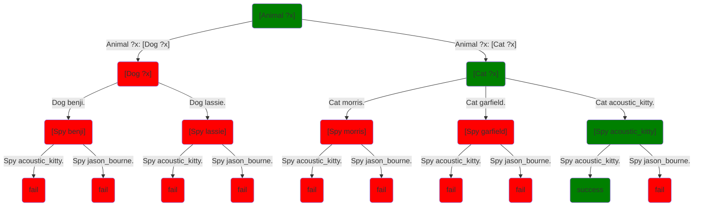

Let's return to our dogs, cats, and spies example:
```step
[predicate]
Dog benji.
Dog lassie.

[predicate]
Cat morris.
Cat garfield.
Cat acoustic_kitty.

[predicate]
Animal ?x: [Dog ?x]
Animal ?x: [Cat ?x]

[predicate]
Human jason_bourne.

[predicate]
Spy acoustic_kitty.
Spy jason_bourne.
```
When we query:
```step
[Animal ?who] [Spy ?who]
```
We are asking the system to find a way to execute this query such that it succeeds rather than fails.  That means making a series of clairvoyant choices about what methods to choose for each call such that:

* The parameters of each call match the parameters of the chosen method
* Each variable has a consistent value throughout execution: we never ask a variable to have two different values at once

As we said before, the choices defined by a program form a tree:

A solution is an execution of the program that doesn't dead end at a red **fail** node, but rather gets all the way to a green **success** node: a green path.  In this particular example, there's only one successful path, but there are often many possible successful paths.  We generally don't care which one we get.  We just want some successful path and we don't want to have to think about how to find it.