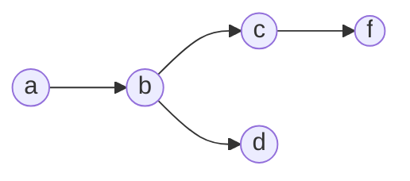

When you choose data structures for your programs, you make assumptions about how the data will be access and whether and how it will be updated.  If you assume you will always start with an `Employee` object and then look up their `JobTitle`, then you can simply put a `JobTitle` field inside the `Employee` class and be done with it.  If, on the other hand, you need to start with a `JobTitle` and enumerate all `Employees` who have that title, then perhaps you need a `JobTitle` object with a field that points to a list of pointers to `Employees`.  If you want to go in both directions you need both.  But then you have to remember that you can’t update one without updating the other.  If you modify the program to support new use cases, you may need to modify many bits of code.  If you miss one, then you have a subtle, difficult to locate bug.

Modern database systems generally don’t work this way.  Instead, you specify the logical organization of the data in terms of entities and relationships between them.  You don’t have direct access to the physical organization of the data.  Instead, you have a query language that lets you ask questions like “who are all the people with job title X who supervise someone with job title Y?”  That will be implemented internally as a set of loops, tests, and/or index lookups.  But the programmer’s SQL query doesn’t specify those algorithmic steps.  It can’t because the programmer doesn’t know the physical layout of the data.  That layout may well change over time.

Logical reasoning systems, including logic programming languages, work the same way.  You describe the knowledge (the data) in terms of a set of predicates (properties and relationships) and rules for their interrelationships, and then interact with that data via queries: questions you ask the system about the data.

For example, you might describe a directed acyclic graph like this:

in terms of its edge predicate (relation):
```step 
# There’s an edge from the node a to the node b, from b to c, etc.
Edge a b.
Edge b c.
Edge b d.
Edge c f.
```
And then define connectedness declaratively:
```step
# Any node ?x is connected to itself
Connected ?x ?x.

# For any nodes ?x, ?y, and ?z,
# if there’s an edge between?x and ?y and ?y is connected to ?z, then ?x is connected to ?z.
Connected ?x ?z: [Edge ?x ?y] [Connected ?y ?z]
```
We can then ask queries like:

| Query	| Meaning	 | Answer |
|------ | --------   | -------|
| `[Edge a f]`	| Is there an edge between `a` and `f`?	 |No |
| `[Edge a ?x]`	| What are the neighbors `?x` of `a`?	| `?x`=`b` |
| `[Connected a f]`	| is `a` connected to `f`?	| Yes|
| `[Connected b ?x]`	|What nodes `?x` are connected to `b`?	| `?x`=`c`, `d`, and/or `f`|

In most languages, the “is” and “what” queries would be different subroutines.  But here, they’re just different ways of querying the same set of rules.

You can try the graph program here if you like:
```Step
# Try: [Connected a f]
Edge a b.
Edge b c.
Edge b d.
Edge c f.

Connected ?x ?x.
Connected ?x ?z: [Edge ?x ?y] [Connected ?y ?z]
```
