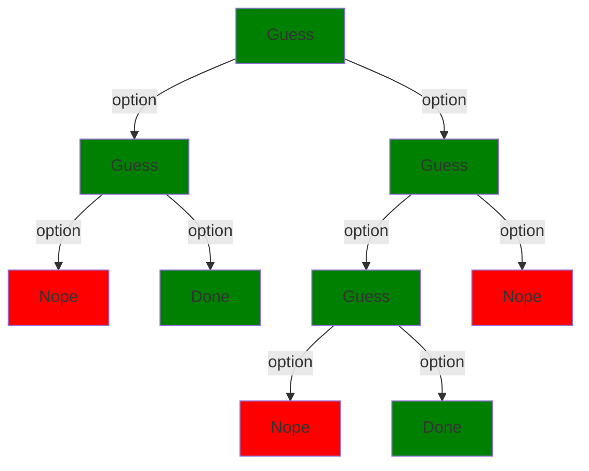

Most declarative programming systems can be classified into two groups, **constraint programming**, and non-deterministic programming, which I'll call **clairvoyant programming**.  We'll defer talking about how these are implemented under the hood (see [Part II](part_ii) for that).  For the moment, we'll focus on what these technologies are and how you can use them.  For most of this I won't assume any significant programming experience, although I'll include additional pages and comments for those who do.

## Clairvoyant programming

Clairvoyant languages are normal programming languages that include an operation for *guessing*.  The program mostly runs normally, but whenever it likes it can lay out some options and tell the computer to guess which one is right.  At other times it can say "nope; you made a bad guess."  The series of choice points of the program form a tree:

Clairvoyant language guarantee they always guess options that lead "done", or give up if not option leads to "done".  In this sense, they predict the future; hence the term "clairvoyant."  However, if there are multiple paths that lead to "done", as above, they often don't guarantee which one they'll choose; hence the term "non-deterministic."

Grammars, planners, and logic programming all fall under this rubric.  These languages let you *under-specify* your programs, leaving many choices up to the computer.  The machine behaves as if it always makes the right choice, even though behind the scenes it's trying alternatives until it finds something that works.

## Constraint programming

Constraint programming is both more and less powerful than clairvoyant programming.  It's less powerful in the sense that not all problems can be phrased as constraint problems.  It's more powerful in the sense that it can be *very* smart at solving those problems that can be phased in its terms.

A **constraint satisfaction problem** is a set of choices to make, together with options for each choice, and a set of restrictions (known as *constraints*) on what options can be selected together.  For example, generating a character might involve choosing:

* A *class* for the character
* A set of numeric *stats* for the character

Constraints on those choices might involve:

* Requiring the sum of the stats be some specific number (i.e. a "build point" system)
* Imposing minimum or maximum values for particular stats given particular choices of class

Alternatively, the problem might be to generate a *party* of multiple characters with additional constraints such as requiring the party contain minimum numbers of support characters, tanks, etc.