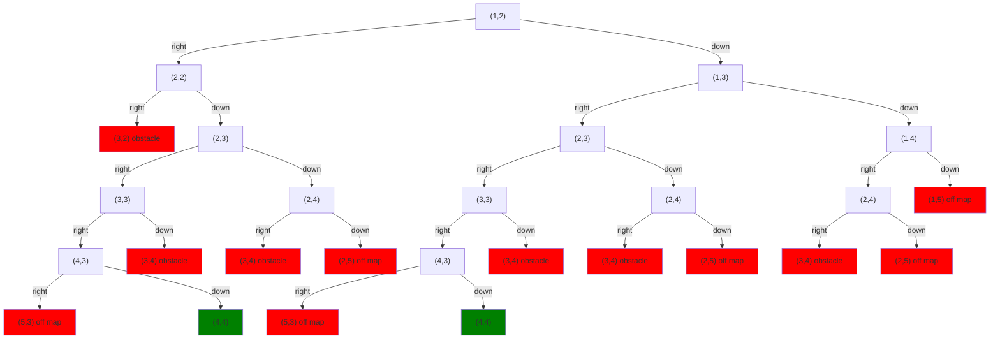

NDScript is a variation of what Alan Turing called a *choice machine*.[^1]   As a program repeatedly executes `choose`, it creates a tree of possibilities.  Some of those branches end prematurely with the execution of `fail`, while others complete successfully.

Visualizing the complete choice tree for our planner is too big to fit nicely on the page here.  But lets say we start at coordinates (1,2) rather than (0,0).  Then we get this tree of possible executions

This has two green (success/solution) paths and a lot of red (fail) paths.  Again, the contract of the system is that it will always choose a green success path, if one exists.  NDScript is written to choose the path randomly, but most nondeterministic languages choose the leftmost successful path.

## Endnotes

[^1]: [Turing, A. M. *On Computable Numbers, with an Application to the Entscheidungsproblem."](https://londmathsoc.onlinelibrary.wiley.com/doi/abs/10.1112/plms/s2-42.1.230).