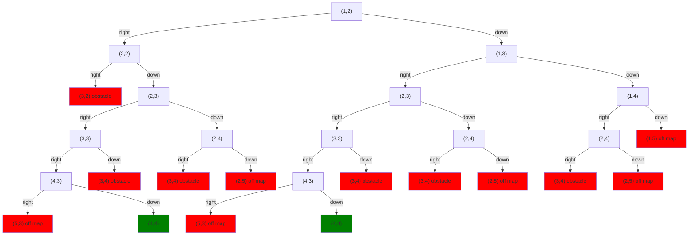
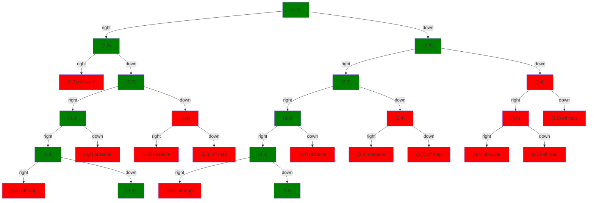

NDScript is a variation of what Alan Turing called a "choice machine."[^1]   Each time it executes `choose`, there are multiple ways it can proceed.  These form a tree of possible executions, branching each time we `choose`.  Some of those branches end prematurely with the execution of `fail`, while others complete successfully.

Visualizing the complete choice tree for our planner is too big to fit nicely on the page here.  But lets say we start at coordinates (1,2) rather than (0,0).  Then we get this tree of possible executions.  We mark success states (where we reach the goal) in green, and fail states (running into an obstacle or off the map) in red:

This has two success paths (paths that end up at green) everything else is a fail path (ends up at red).  The system's job is to always choose a success path.  Again, this is hard because it doesn't know which choices lead to success until it either finishes (success) or it executes `fail`.

That said, we can illustrate it for ourselves by coloring the interior nodes so that they're green if they're on a success path and red if otherwise.  Then we get this:

Again, the contract of the system is that it will always choose a successful path, provided one exists.  When there are multiple successful paths, NDScript is written to choose one randomly.  But most nondeterministic languages choose the leftmost one.

## Notes

[^1]: [Turing, A. M. *On Computable Numbers, with an Application to the Entscheidungsproblem."](https://londmathsoc.onlinelibrary.wiley.com/doi/abs/10.1112/plms/s2-42.1.230).