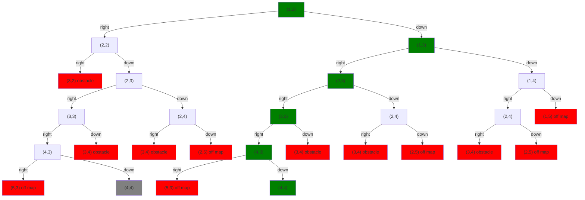
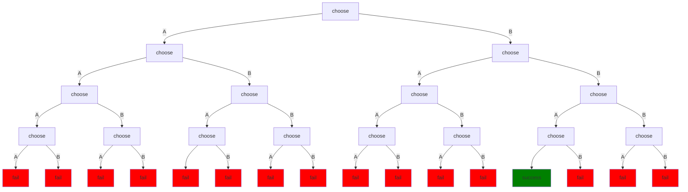

Now let's think about the execution time of this algorithm.  Again, the core loop is just:
```ndscript
while (!done()) choose right(); or down();
```
Real clairvoyant machines don't exist.  But if they did, their execution time would just be the time it takes for them to run the chosen (successful) path.  For example, this path, shown in green:

Each step in that path represents one choice point.  There's one choice point per iteration of the loop and each iteration takes a fixed amount of time (technically, $O(1)$ time[^fixedamount]).  So for this algorithm, execution time on a true clairvoyant machine would be proportional to the length of the chosen path.  For an $n\times n$ grid, that path has $n-1$ right motions and $n-1$ down motions, so a total of $2n-2$ iterations.  The cost is $O(n)$, which is often paraphrased as "roughly proportional to $n$", although the true meaning is a little more complicated.[^bigO]

That's for a truly clairvoyant machine.  For a real machine, we use some kind of a solver to run the algorithm.  We'll talk about that [next](ndscript_execution).  For the moment, we just need to know it uses some process of trial and error to find a path that works.

In the **best case**, the solver guesses a successful path on the first try and so it's more or less the same as the clairvoyant system.  But in the **worst case**, the solver has to try **all nodes** in the choice tree.  How many nodes is that?  For the graph above, which is only a partial graph of our 5x5 pathfinding problem, that's 27 nodes, rather than the 6 along the selected successful path.

## Intractability

More generally, suppose we have an NDScript program that make a series of 2-way choices.  To keep the analysis simple, let's assume it never fails or succeeds until all the choices have been made.  Then the choice tree looks something like this:

The first level of the tree has one node, the second 2, the third 4, the next 8, etc.  Level $i$ has $2^{i-1}$ nodes.  And a tree with $h$ levels has $2^h-1$ nodes; the tree above, which has height 5, has 31 nodes.  So a solver that is lucky and finds the correct path right away, only explores 5 nodes.  But a solver that has to try every node has to look at 31.  The difference is more dramatic the levels in the tree.  For 10 choices, the lucky scenario looks at 10 nodes, but the worst-case scenario looks at 1023 nodes.

More generally, if a solver runs a program that makes a series on $n$ 2-way choices, then the **best** we can hope for is that it runs in $O(n)$ time.[^bestcase]  That requires it to more or less always guess right.  But the **worst case**, where it has to explore the whole tree, will require at least $O(2^n)$ time.[^worstcase]  That is to say, it's **exponential time**, which is horrific[^exponentials]: each additional choice doubles the execution time.  If the choices are $k$-way rather than 2-way, then it's $O(k^n)$ time, which is even worse.

Exponential algorithms don't scale well.  Problems that require exponential algorithms are said to be [intractable](wiki:Computational_complexity_theory#Intractability).  As far as we know, simulating clairvoyant algorithms requires exponential time in the general case.[^PNP]

## Real-world applications

The good news is that a surprising number of problems of practical interest can be solved surprisingly quickly, even by relatively simple solvers.  Sometimes this is because choice tree is so full of solutions the solver can't help but stumble in to one.  Sometimes it's because $n$ is small and so it doesn't really matter if the algorithm is efficient.  And sometimes careful attention to the design of the algorithm can help keep the solver from getting side-tracked.  We'll talk more about these issues later.

## Notes

[^fixedamount]: I'm waiving my hands here: it's not technically fixed.  Each iteration calls `done` once and either `right` or `down` once.  These all have `if`s and/or `||`s.  Those take a variable amount of time to execution, but they still have a maximum amount of time they can take.  So if we just pretend they always take that maximal amount, we can treat each call as a fixed cost.  That will never underestimate time and will never overestimate by more than a fixed factor.  The formal way of saying this is that they each take $O(1)$ time.

[^bigO]: We have to use $O()$ notation rather than just saying "is proportional to" because execution times are almost never *exactly* proportional to anything.  So the $O(f(n))$ notation says that for large enough values of $n$, the thing being describe is never *larger* than some multiple of $f(n)$.  What multiple?  We don't specify because we don't care.  We care that it's roughly growing with the same shape as $f(n)$.  Why "for large enough values"?  Because $f(n)$ is usually some function that's zero when $n$ is zero and no algorithm runs in zero time -- it at least has to execute a return instruction.  So we ignore the question of proportionality for small values of n.  The actual formal definition of big O is that when we say $g(n) = O(f(n))$ we mean that there are constants $n_0$ and $k$ such that $g(n) \leq kf(n)$ for all $n > n_0$.

[^bestcase]: This is assuming the program does no other work besides making the choices.  If it's running some expensive algorithm between consecutive choices, then it will be worse.  Again, this is the best-case scenario.

[^worstcase]: Again, this is only accounted for the time spent making choices.  It may be worse if we're doing a lot between the choices.  The details don't matter for us.  What matters is that simulating clairvoyance can add an exponentially large penalty to execution time.

[^exponentials]: [Complexity theory](wiki:Computational_complexity_theory) places a lot of attention the distinction between problems that can be solved in *polynomial time*, that is $O(n^k)$ time for some $k$, and exponential time, that is $O(k^n)$ for some $k$.  The reason for this is that every polynomial scales better (more slowly) than every exponential.  In particular the ratio of any exponential to any polynomial goes to infinity as $n$ grows:
$$
\lim_{n\rightarrow\infty}\frac{(k_1)^n}{n^{k_2}}=\infty
$$
no matter what $k_1, k_2$ we choose.  In fact, it's common to treat polynomial-time as meaning "tractable".  But as a practical matter, even polynomial algorithms are generally impractical unless $k$ or $n$ is small.

[^PNP]: The question of whether there's a way to simulate non-deterministic (clairvoyant) algorithms with a sub-exponential penalty is essentially the [P vs NP question](wiki:P_versus_NP_problem).  Thus far, no one has been able to prove it's impossible or that it's possible.  But it's generally believed that even if it's possible in principle, that in practice it would still be impractically slow.  You certainly wouldn't want to bet money on it being possible.