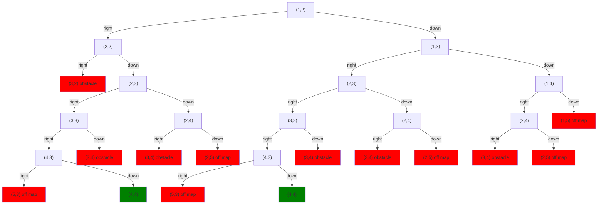

Obviously real silicon is not clairvoyant.  Neither are quantum computers.  So if the system is going to find a successful path through a choice tree, it's going to have to do tree search.

If you're reading this chapter, then you've probably taken a data structures course and studied [depth-first](wiki:Depth-first_search) and [breadth-first](wiki:Breadth-first_search) search, and probably [Dijkstra's algorithm](wiki:Dijkstra%27s_algorithm).  If you've taken an introductory AI course, you've probably also studied heuristic search algorithms like [A*](wiki:A*_search_algorithm) and [beam search](wiki:Beam_search).  Any of these could be used in principle, although to use Dijsktra or heuristic search the programmer would need to specify some cost or heuristic function to optimize.

## Depth-first search

In practice however, most systems, such as [Prolog](wiki:Prolog), use [depth-first search](wiki:Depth-first_search).  And although breadth-first has the same asymptotic complexity (i.e. they're both worst-case linear time and space), in practice DFS is usually faster and uses less space.

Another name for depth-first search of a choice tree is **backtracking**.

### Infinite recursion

The disadvantage of DFS compared to the other search methods is that if the tree has any infinite paths -- which would correspond to infinite loops or infinite recursions -- then it can get lost in them and never investigate the other paths.  This is the reason most nondeterministic languages look not for a random path like NDScript, but for the *leftmost* path in the tree.  That lets the programmer steer the system around infinite recursions, for example, by making sure the system tries base cases before recursive cases.  NDScript lets you do this too, by saying `choose first` rather than `choose`.

Let's talk some more about solution choice.

