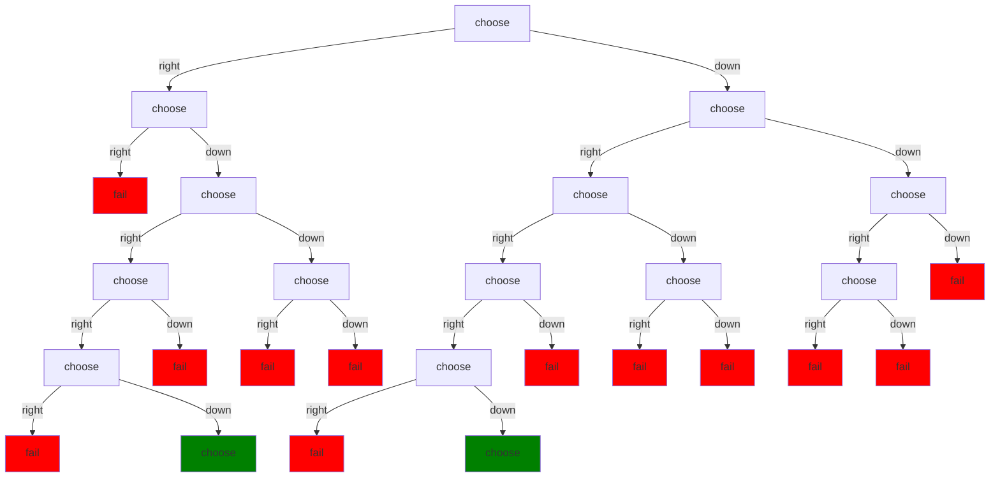
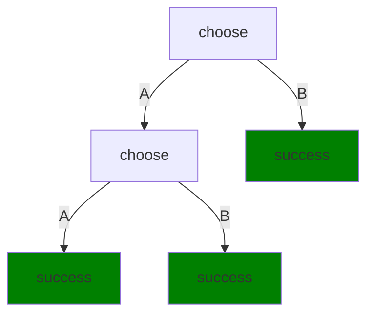
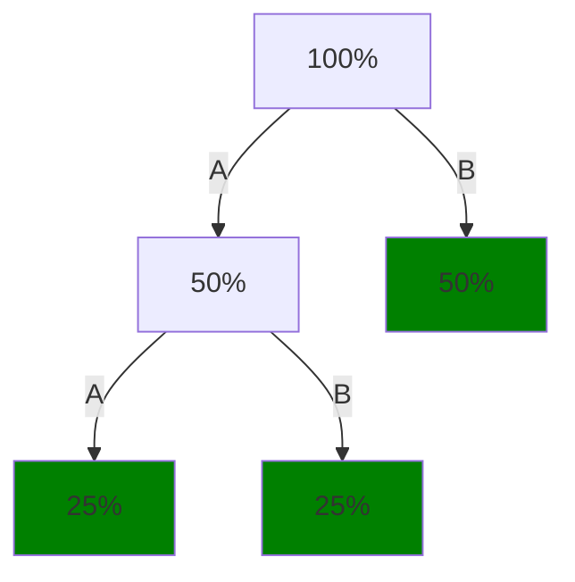

As we said, most systems use some variant of depth-first search.  There are a lot of variants, including versions that [track dependencies between choices](wiki:backjumping) in an effort to intelligently skip over parts of the tree that don't need to be searched.  Most of these are beyond the scope of Part I.  But there are a few variants that should be mentioned here because they impact the programmer.

Remember that depth-first search means something like this:

```
DFS(node) {
    if (IsGoal(node))
        // we're done - do whatever we want to do now
    else 
        foreach (option of node.Options)
             DFS(option);
}
```
I'm being deliberately vague about what if anything DFS returns or what the "do whatever we want to do now" part is.  It can get very technical very fast, but it's irrelevant for now.  See [Part II](part_ii) for more discussion.

Since the tree we're searching is a tree of choices:

the `node` is a particular execution of `choose`, `chooseElement`, or other choice point.  And its `Options` are the different options provided by the programmer.

Let's talk about some common variations of this.

## Choice order

The algorithm doesn't specify what order we try the options in.  That is to say, it doesn't specify the order in which it tries thechildren of a given node.  But obviously, the order we try the children in impacts which solution we get if there are multiple solutions.

### Fixed order

The simplest design is to always try the options in the order they appear in the source code.  This is the order you get in a language like [Prolog](wiki:prolog) and in NDScript when you say `choose first` instead of just `choose`.

If we try the options for *all* choices this way, then we will always get the same solution.  That's bad if you're doing procedural content generation, where you want to generate random artifacts.  But it's useful when you want to express a strict preference for one option over another.  With fixed order, it will always try to choose the first option.  It will only choose the second option if there are not solutions involving the first.  It will only choose the third if there are no solutions involving the first or second.  And so on.

Logic programming languages generally use fixed order and programmers know and depend on that.  For recursive code, they always put the base case choices first and the recursive choices later, so the system only recurses when it has to.

### Uniform random order

If we try the children in random order, we get random solutions in the sense that we don't generally get the same solution each time we run it, and any solution can potentially be chosen.  This is very useful for games and is the behavior you get in NDScript if you say `choose` rather than `choose first`.

The code for uniform random search just involves adding a [shuffle](wiki:Fisher–Yates_shuffle) of the options:
```
DFS(node) {
    if (IsGoal(node))
        // we're done
    else 
        foreach (option of Shuffle(node.Options))
             DFS(option);
}
```
Here, Shuffle takes the options and returns a copy of the list with the order of the elements randomized.  For a discussion of how to do fast randomization see [the appendix](randomization).

Shuffling the children means each option has an equal chance of being tried first.  However, that doesn't mean that every solution will be equally probable.  Suppose we just have a couple of 2-way choices and no failure:

There are three solution paths and we choose randomly between them.  However, suppose each choice is 50% A 50% B.  Then the probability of going through each node is:

All things being equal, the probability of choosing a solution decreases with the number of choices required to choose it.

### Weighted random order

If you want more control over the distribution of solutions, the easiest thing is to let the programmer specify weights (relative probabilities) for each of the options.  Then instead of doing a normal shuffle (every option is equally likely to be first), you do a weighted shuffle (the probability of a given option being tried first is proportional to its weight):
```
DFS(node) {
    if (IsGoal(node))
        // we're done
    else 
        foreach (option of WeightedShuffle(node.Options, node.OptionWeights))
             DFS(option);
}
```
You do a weighted shuffle in $O(n \log n)$ time and $O(n)$ space.  See [the appendix](randomization).


## Iterative deepening (technical)

As we mentioned, the standard depth-first search can go into infinite recursion if it encounters an endless series of choices along some path.  The standard solution is to use fixed-order search and have the choices that involve deep paths come later in the search.  However, an alternative is to put a limit on the depth the search can go:

```
DFS(node, maxDepth) {
    if (IsGoal(node))
        // we're done - do whatever we want to do now
    else if (maxDepth > 0)
        foreach (option of node.Options)
             DFS(option, maxDepth-1);
}
```

This works if you know the depth of the solution in advance, but that's rare.  Instead, we can try it with increasing depths:

```
DFS(node) {
   maxDepth = 0;
   while (not done)
      DFSToDepth(node, maxDepth++);
}

DFSToDepth(node, maxDepth) {
    if (IsGoal(node))
        // we're done - do whatever we want to do now
    else if (maxDepth > 0)
        foreach (option of node.Options)
             DFSToDepth(option, maxDepth-1);
}
```

This strategy is called [**iterative deepening**](wiki:Iterative_deepening_depth-first_search).  It seems insane because we keep searching the same nodes repeatedly.  And indeed, it's a bad choice for many problems.

The reason it's not *always* a bad choice is that, as we said, trees tend to get exponentially bigger as we go deeper.  For a many trees that come up in AI, each level might have 100 times more nodes.  In that case, re-searching the 1% of nodes that you already searched the previous iteration doesn't matter much.  

Still, you might wonder why you wouldn't just use breadth-first search.  If there are $n$ nodes in the tree then both DFS and BFS are $O(n)$.  Why mess with iterative deepening?

The answer is memory use.  Depth-first search uses memory proportional to the depth of the tree.  BFS uses memory proportional to the *size* of the tree.  As we said, in the general case, the size is exponential in the depth.  For large problems, it's easy for BFS to run out of physical memory and start paging.  In scenarios like that, DFS with iterative deepening is much more attractive.

Although I would not advocate it as a replacement for [A*](wiki:A*_search_algorithm) in [navmesh](wiki:navigation_mesh) path planning in games, iterative deepening is also used to find least-cost, or at least low-cost solutions.  And in fact, the implementation of the `minimize` primitive we will discuss shortly uses iterative deepening.