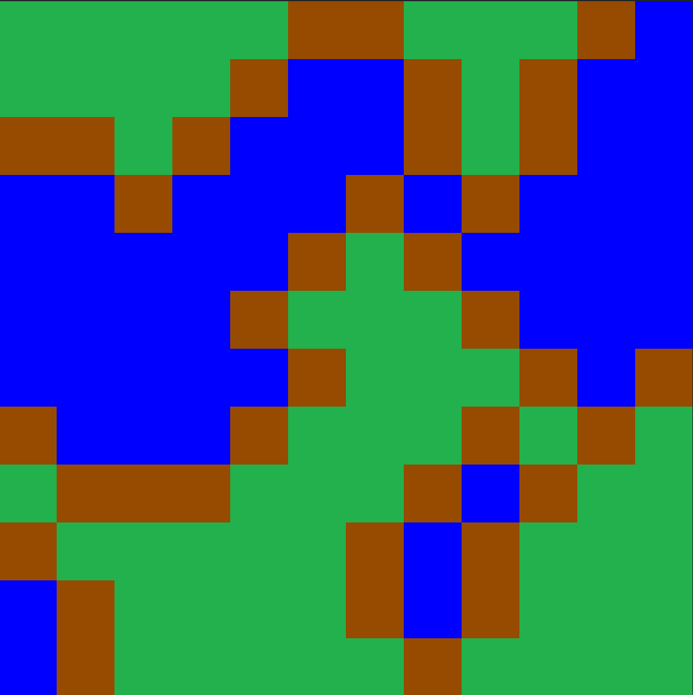

<br>
<br>

Level generation is a standard procedural content generation task.  For tile-based levels, this amounts to choosing the tiles to place in different locations.  Different games have different requirements for a level to be playable: maybe it's a maze, and the maze has to be solvable.  Or maybe it has to have a reasonable balance of enemies and resources with which to fight them.
<p>
Let's look at how we can generate maps of land and water.  We'll have three kinds of tiles:

* Grass (land)
* Sand (land)
* Sea (water)

To keep it from being trivial, let's assume the water is seawater and the grass won't grow next to it:

> **Constraint**: no grass tile can be next to a water file

 In other words, there must be a sand tile between any pair of grass and sea tiles.
 
 We could generate a map with an algorithm like this:
```ndscript
foreach (position in positionsOf(grid))
   grid[position] = chooseElement(setOf(grass, sand, water));

foreach (position in positionsOf(grid))
   foreach (neighbor in neighborsOf(position, grid))
     if (!compatible(grid[position], grid[neighbor]))
        fail;
```
This is a completely valid program.  It chooses tiles for each grid position then checks each tile against its neighbors for violations of the constraint that water and grass can't be adjacent.  If so, it rejects that set of choices.

This will work for very small maps.  However, it gives the solver no opportunities to be clever in its search.  When run on real hardware, it will take [exponential time](execution_time).

The problem here is that since computers aren't *actually* clairvoyant, the solver is ultimately trying different sets of choices until it finds one that doesn't `fail`.  The algorithm above makes all the choices first, and only checks them afterward.  For each grid position, there are three possible choices.  So for an $n \times n$ grid, there are $3^{n^2}$ possible sets of choices.  For a $10\times 10$ grid, that's a little over 500 quattuordecillion ($5\times 10^{47}$) possible choice sets.  And most of those will have water next to grass somewhere inside them, so they will fail.

So that isn't going to work.

This exposes one of the unhappy facts of declarative programming: some declarative programs run slower than others, often exponentially slower.  So you need to pay some attention to efficiency and complexity even with clairvoyant algorithms.