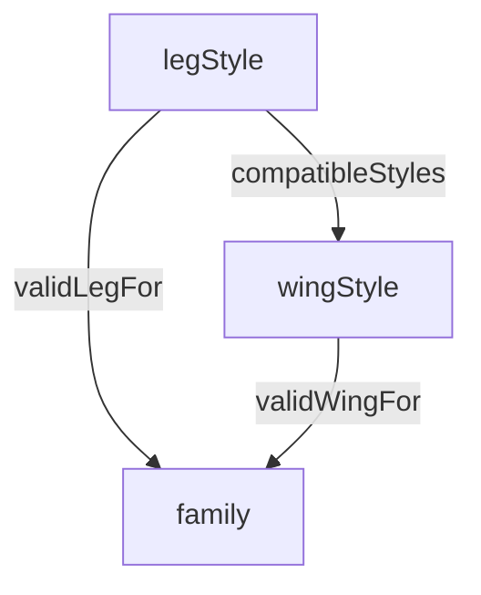

In [map generation](map_generation) we looked at how to generate tilemaps using constraint propagation.  Now, we'll use the same basic ideas to solve a different constraint problem: generating random animals.

## Attributes

We'll describe our animals in terms of three attributes:
* *Leg style*: quadruped, biped, fins, or none (i.e. snake-like)
* *Wing style*: wings or none
* *Family*: mammal, reptile, bird, fish, or alien

We will represent one of our animals as an object with fields for each attribute: leg style, wing style, and family.  Since we'll be using constriant-propagation, we'll initialize each of these to be **the set of all possible values for that attribute**, then gradually narrow the sets until each only has a single value (i.e. it's a *singleton set*):
```ndscript
var animal =  { 
    legStyle: setOf("quadruped", "biped", "fins", "none"),
    wingStyle: setOf("wings", "none"),
    family: setOf("mammal", "reptile", "bird", "fish", "alien")
};
```

## Constraints

These attributes can't be chosen entirely independently.  Mammals don't have fins.  Fish don't have wings.  And while aliens might allow combinations that don't exist on earth, such as winged quadrupeds, some combinations don't make sense, such as snakes with wings.  So we'll represent this as a set of constraints between the variables:


The leg styles that are valid for a given family is given by the `validLegFor` relation.  mammals and reptiles can have most kinds of legs, but fish can only have fins or be snakes:
```ndscript
var validLegFor = relation(
    [ "quadruped", "mammal" ],
    [ "quadruped", "reptile" ],
    [ "quadruped", "alien" ],
    [ "biped", "mammal" ],
    [ "biped", "reptile" ], 
    [ "biped", "bird" ], 
    [ "biped", "alien" ], 
    [ "none", "reptile" ], 
    [ "none", "fish" ], 
    [ "none", "alien" ], 
    [ "fins", "fish" ],
    [ "fins", "alien" ]
);
```

Wing styles are more restrictive.  Only birds and aliens can have wings:
```ndscript
var validWingFor = relation(
    [ "wings", "bird" ],
    [ "wings", "alien" ],
    [ "none", "mammal" ],
    [ "none", "reptile" ],
    [ "none", "fish" ],
    [ "none", "alien" ]
);
```

And finally, there are a few combinations of wing/legs that don't work.  You can't have wings and fins at once, or wings on a snake (it would tip over):
```ndscript
var compatibleStyles = relation(
    [ "quadruped", "wings" ],
    [ "quadruped", "none" ],
    [ "biped", "wings" ],
    [ "biped", "none" ],
    [ "fins", "none" ],
    [ "none", "none" ]
);
```
Finally, we have a table of constraints and the attributes they apply to:
```ndscript
var constraints = [
    [ "legStyle", validLegFor, "family" ],
    [ "wingStyle", validWingFor, "family" ],
    [ "legStyle", compatibleStyles, "wingStyle" ]
];
```
These say that:
* `validLegFor` has to hold between `legStyle` on the left (first argument) and `family` on the right (second argument)
* `validWingFor` has to hold between `wingStyle` on the left and `family` on the right
* `compatibleStyles` has to hold between `legStyle` on the left and `wingStyle` on the right

## Writing a solver

Write a solver for this algorithm in NDScript.  We've included a code skeleton below.  You should use the basic constraint propagation technique discussed in class:

* Track the sets of possible values for each variable (attribute of the animal)
* Initialize them all to their full sets of possibilities
* Repeatedly choose an attribute and select its value from its remaining possibilities
* Whenever you narrow a attribute A, use its constraints to narrow the attributes it's connected to
  * Find the image of A's set of possible values through the constraint's relation
     * If A is on the left in the constraint, use the right image, if it's on the right, use the left image
  * Narrow the other variable to that set
  * Recursively narrow the variables connected to it, as needed

The simplest way to write it is to use the recursive formulation we used in class.  However, feel free to write it using a queue if you prefer.

As in JavaScript, compound objects such as `animal` behave both as record structures and as dictionaries.  So to find the current value of legStyle, you can say either `animal.legStyle` or `animal["legStyle"]`.  For this assignment, the latter will be easier to use.  You can also update the object using assignment statements as usual, i.e. `animal.legStyle = newValue` or `animal["legStyle"] = newValue`.

You will want to use some or all the following built-in functions for this:

* Accessing objects
    * `nonsingletonFieldsOf(object)`  
        Returns the names of the fields of the compound object that are set to non-singleton sets.  Initially, `nonsingletonFieldsOf(animal)` = `["legStyle", "wingStyle", "family"]`.
* Sets
    * `setOf(value, ...)`  
        The set of the specified values
    * `intersection(set, set)`  
        The set of elements common to both arguments.
    * `isEmpty(collection)`  
        True if the collection has no elements
* Relations
    * `leftImage(relation, set)`, `rightImage(relation, set)`  
        The image of the set under the relation.
* Old friends from the last assignment
    * `chooseElement(collection)`  
        Non-deterministically chooses an element from the collection.
    * `print(values, ...)`, `printLine(values, ...)`  
        Prints the specified values.  The results are "unprinted" if we backtrack.

Here is your starter code.  Fill in `solve()` and `narrowTo()`.  Helper functions aren't necessary, but feel free to use them if you like (I used one for my reference solution).

When you are finished, press the download button to save it to a file and upload the file to canvas.

```NDScript
var animal =  { 
    legStyle: setOf("quadruped", "biped", "fins", "none"),
    wingStyle: setOf("wings", "none"),
    family: setOf("mammal", "reptile", "bird", "fish", "alien")
};

var validLegFor = relation(
    [ "quadruped", "mammal" ],
    [ "quadruped", "reptile" ],
    [ "quadruped", "alien" ],
    [ "biped", "mammal" ],
    [ "biped", "reptile" ], 
    [ "biped", "bird" ], 
    [ "biped", "alien" ], 
    [ "none", "reptile" ], 
    [ "none", "fish" ], 
    [ "none", "alien" ], 
    [ "fins", "fish" ],
    [ "fins", "alien" ]
);

var validWingFor = relation(
    [ "wings", "bird" ],
    [ "wings", "alien" ],
    [ "none", "mammal" ],
    [ "none", "reptile" ],
    [ "none", "fish" ],
    [ "none", "alien" ]
);

var compatibleStyles = relation(
    [ "quadruped", "wings" ],
    [ "quadruped", "none" ],
    [ "biped", "wings" ],
    [ "biped", "none" ],
    [ "fins", "none" ],
    [ "none", "none" ]
);

var constraints = [
    [ "legStyle", validLegFor, "family" ],
    [ "wingStyle", validWingFor, "family" ],
    [ "legStyle", compatibleStyles, "wingStyle" ]
];

function solve() {
    // Fill me in
    // Repeatedly choose attributes of animal that aren't singleton sets, choose an element, and narrow it.

    print(animal);
}

deterministic function narrowTo(attribute, set) {
    // Fill me in
    // Remove from animal[attribute] any elements not in set.
    // Fail if the result is empty, propagate to other attributes as necessary.
}

solve();
```