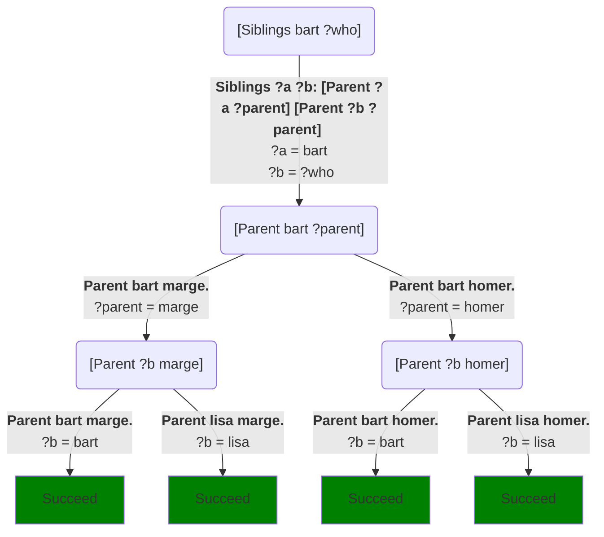
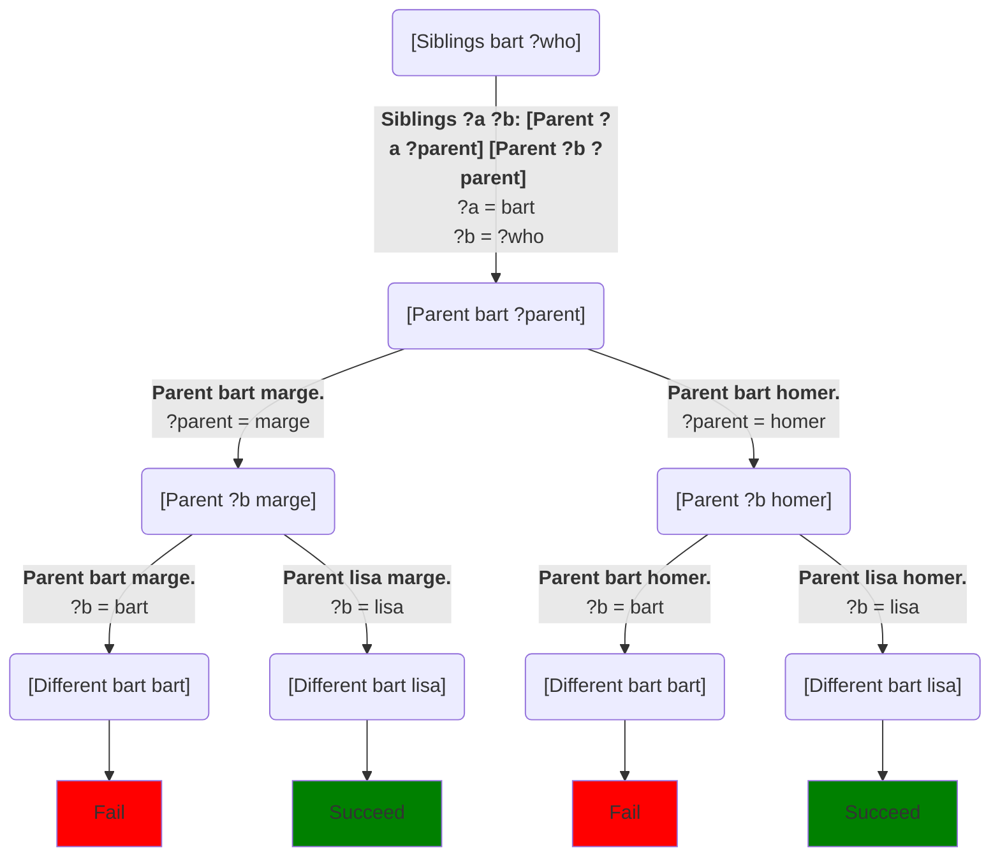

## Reasoning about family relationships

Let’s return to our definition of siblinghood, and add a few family members to reason about:
```Step
# Try: [Siblings bart ?who]
[predicate]
Siblings ?a ?b: [Parent ?a ?parent] [Parent ?b ?parent]

[predicate]
Parent bart marge.
Parent bart homer.
Parent lisa homer.
Parent lisa marge.
Parent stan sharon.
Parent stan randy.
Parent randy grandpa.
Parent jimbo grandpa.
```
If we use the call `[Siblings bart ?who]` to ask who Bart's siblings are, we get the following choice tree.  Again, I'll only include the methods that match, so as to keep the diagram manageable:

There are a couple of things worth noticing here.  First, under this definition, **people are their own siblings**.  Moreover, since we didn't mark anything `[randomly]`, it always chooses the leftmost solution, which is that Bart is his own sibling.  If we don't want that, we can fix it by modifying the definition:
```Step
# Try: [Siblings bart ?who]
[predicate]
Siblings ?a ?b: [Parent ?a ?parent] [Parent ?b ?parent] [Different ?a ?b]

[predicate]
Parent bart marge.
Parent bart homer.
Parent lisa homer.
Parent lisa marge.
Parent stan sharon.
Parent stan randy.
Parent randy grandpa.
Parent jimbo grandpa.
```
`Different` is a [built-in predicate](primitive_tasks): it's not defined in terms of methods; rather, is a part of Step itself.  It succeeds if its two parameters are different, and fails if they're the same.  This gives us a slightly more elaborate choice tree, but one that filters out the result that Bart is his own sibling:


The other thing to notice here is that there are actually two different choice paths that give the same answer (Lisa).  That's fairly common in logic programming and generally not something to worry about.
