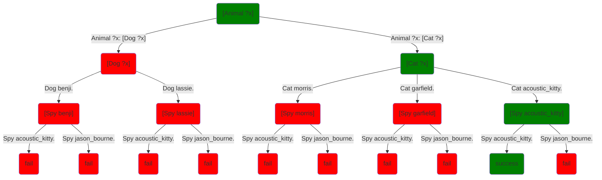

Again, here's our cats, dogs, and spies example:
```step
[predicate]
Dog benji.
Dog lassie.

[predicate]
Cat morris.
Cat garfield.
Cat acoustic_kitty.

[predicate]
Animal ?x: [Dog ?x]
Animal ?x: [Cat ?x]

[predicate]
Human jason_bourne.

[predicate]
Spy acoustic_kitty.
Spy jason_bourne.
```
When we query `[Animal ?who] [Spy ?who]` it runs the `Animal` call, then the `Spy` call.  For the `Animal` call, it has its choice of two methods, one of which calls `Dog` and one of which runs `Cat`.  Each of those has a choice of two methods.  When one works, we then run `Spy`, which also has a choice of two methods.  So in the process of running the query, it makes a series of choices that form a tree:

## The laws of clairvoyance

Ultimately, this is what Alan Turing called a *choice machine*: it makes a series of choices that lead to other choices, and ultimately to success or failure.  In this case, the choices are which method to use for a given call, although we will look at other kinds of choices in other chapters.  What matters for the moment is that when making choices the system acts as if it **always guesses right**: it will always find a green path if there is one.

### Fine print (technical)
Again, there's some find print.  Here's the verison with the fine print:

* **Soundness** if the program succeeds, it has taken a successful series of choices.
* **Completeness** if the tree of choices is finite and contains a successful sequence of choices, the system make will a successful sequence of choices; if not, it will signal failure.

There's also a little extra fine print, since in Step tasks can be `[randomized]` or not.  Your program can easily have multiple solutions (multiple green paths).  As we said, the query `[Animal ?]` has four different solutions.  If all your tasks are randomized, then you get a randomly chosen solution.  But if tasks aren't randomized, then it always gives you the **leftmost** solution in the tree.  That ends up being important when we get to recursion.

## Nondeterminism (esoteric)

These days, the conventional term for this is **nondeterminism** and algorithms that make choices that are presumed always to be correct are called **nondeterministic algorithms**.  I don't love that term, partly because the word nondeterminism is used to mean many other things in computer science, all of which are very, very bad.  But also, it doesn't communicate the essential point of it: that it always guesses right when there is a right choice to guess.