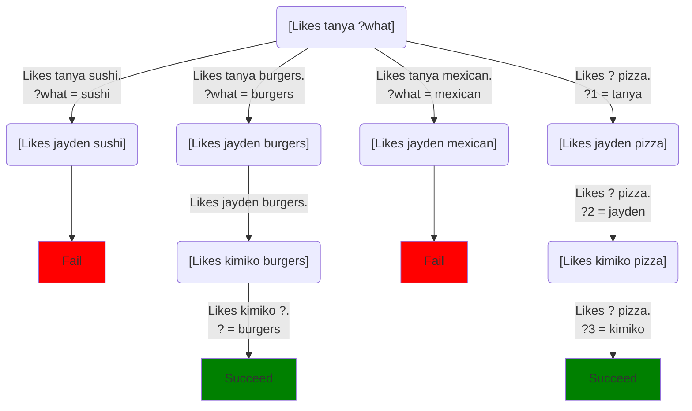

To recap, we can ask questions by calling a predicate.  For example, if we say:
```step
[Likes tanya ?what]
```
The system will look for a `?what` that Tanya likes and report it back.

But what if we do **several calls in a row** as one command?
```step
[Likes tanya ?what] [Likes jayden ?what] [Likes kimiko ?what]
```
It contains the original call `[Likes tanya ?what]` so it will select a `?what` that Tanya likes.  But by the same reasoning, it also has to select a `?what` that Jayden likes and that Kimiko likes.  We can ignore the details of how it finds that `?what`.  But if it does generate an answer, it has to be an answer that all three characters like.  You can try it yourself:
```Step
# Try: [Likes tanya ?what] [Likes jayden ?what] [Likes kimiko ?what]
[predicate] [randomly]
Likes tanya sushi.
Likes tanya burgers.
Likes tanya mexican.
Likes jayden burgers.
Likes jayden ethiopean.
# Kimiko likes everything
Likes kimiko ?.
# Everyone likes pizza.
Likes ? pizza.
```
Here, we've added `[randomly]` to the definitions so it can generate different foods if you run it repeatedly.  But notice that it only generates foods that all three like --- in this case, burgers and pizza.

What's going on when we run that?  It runs the first call, then the second, then the third.  Each call involves a choice from a set of methods.  So we have a choice tree like this.  To save screen space, I won't include all the methods that don't match, just the methods that do.  When a call has no matching methods, I put a little red "Fail" beneath it:


## Multiple calls effectively mean "and"

This demonstrates a general principle: if some call effectively asks if one thing is true, and another call asks if some other thing is true, then running them both in one command asks if they're both true.

And if they're questions that involve filling in variables, then we're effective asking for a set of variable values that work for both calls.  So when we're thinking of calls as asking questions, we think of *sequences* of calls as asking what values of their variables make them all true simultaneously.

## Advanced: what about "or"/"not"?

At this point, you might be saying "that's great, but what if I want to ask an 'or' question rather than an 'and' question?"  The short answer is that you can do it, but it uses a [special kind of predicate](higher-order_tasks) we haven't talked about yet, one whose parameters are themselves questions (calls).  So don't worry about that yet.  We'll get to it soon enough.

That said, if you're curious, you can form "or" questions using the `Or` predicate:
```step
[Or [Likes tanya ?what] [Likes jayden ?what]]
```
will give you back a `?what` that either Tanya likes or Jayden likes, or both.  There are also `And` and `Not` predicates, although `Not` has a number of caveats we'll talk about later.

