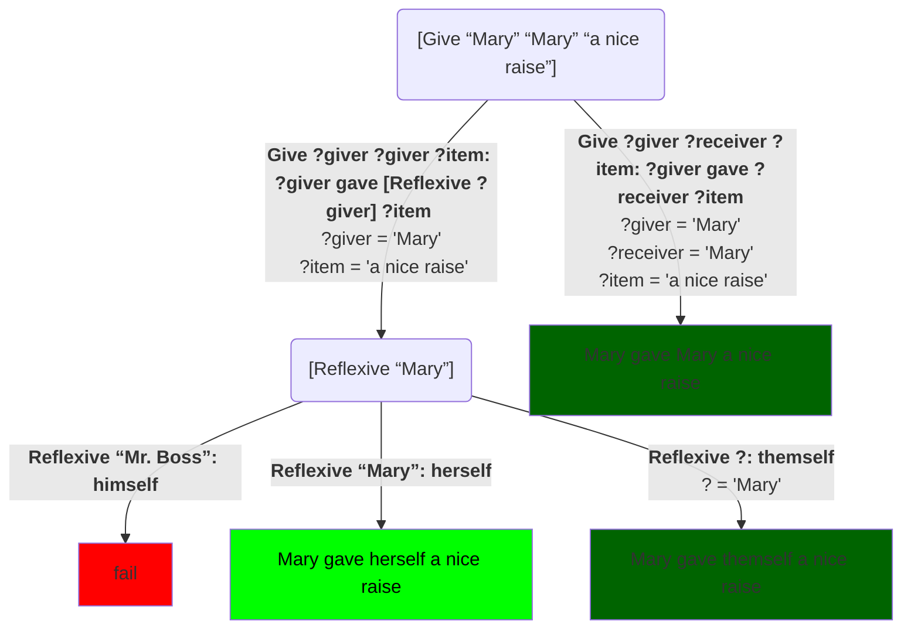

The "themself" example brings up the issue that English *marks* certain words for gender: “himself” implies the person spoken of identifies as male or otherwise prefers male pronouns.  However, the code above uses the fixed text “themself” regardless of who the `?giver` is.

We can generate different pronouns for different characters by making pronoun generation its own task.  The pronouns “himself”, "herself", and "themself" are called *reflexive* pronouns, so we’ll call the task `Reflexive`:
```Step
# Try: [Reflexive "Mr. Boss"]
Reflexive “Mr. Boss”: himself
Reflexive “Mary”: herself
Reflexive ?: themself
```
Calling `[Reflexive ?who]` will print out whatever reflexive pronoun is used by `?who`.  Notice that the first two of these methods specify **specific values** for their parameters.  The first method will only match when the parameter is `“Mr. Boss”`.  For any other value, it will fail to match, and the system will move on to the second method.  But it will only match for the specific value, `“Mary”`.  So we have Mary and Mr. Boss covered.  The last method is a catch-all.  If the parameter is anything else (remember `?` is a variable), then the system will be conservative and print “themself”.

> **Note:** Remember that the system prefers methods that come earlier in the file, so it's important that any catch-all methods be put last.

We can then use this to correct the behavior of `Give`:
```Step
# Try: [Give “Mary” “Mary” “a nice raise”]
Give ?giver ?giver ?item: ?giver gave [Reflexive ?giver] ?item
Give ?giver ?receiver ?item: ?giver gave ?receiver ?item

Reflexive “Mr. Boss”: himself
Reflexive “Mary”: herself
Reflexive ?: themself
```
Here's the choice tree for this example:

Since neither of these tasks is tagged `[randomly]`, the system will always prefer the earlier methods over the later ones.  So even though there are three valid sets of choices, it will always choose the one that involves the highest priority methods.  That corresponds to choosing the *leftmost* solution in the choice tree above.  So it always chooses:

> Mary give herself a nice raise

which is the behavior we want.
