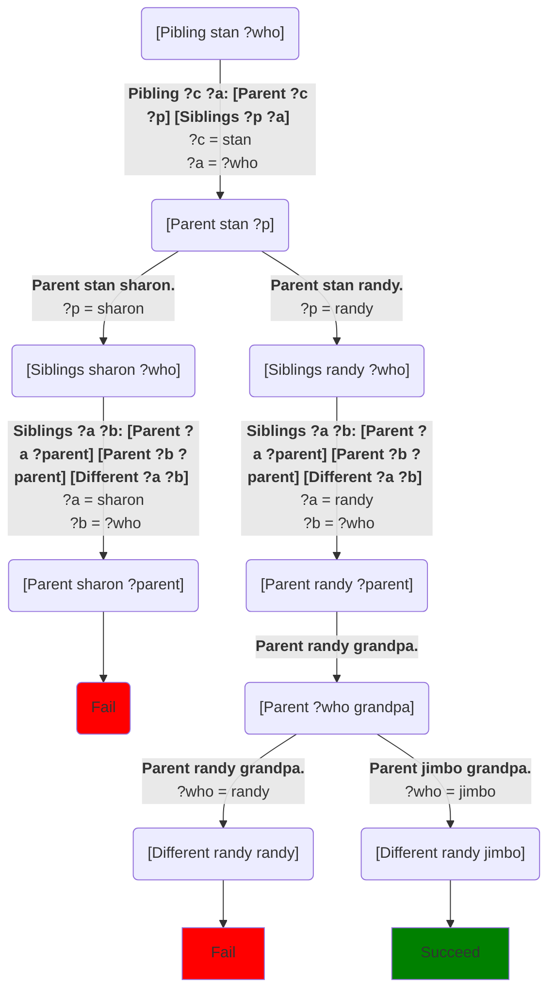

A [pibling](https://en.wikipedia.org/wiki/Family#Roles) is a parent's sibling, i.e. an aunt or uncle.  We can define piblings easily in terms of parents and siblings:
```Step
# Try: [Pibling stan ?who]
[predicate]
Pibling ?c ?a: [Parent ?c ?p] [Siblings ?p ?a]

[predicate]
Siblings ?a ?b: [Parent ?a ?parent] [Parent ?b ?parent] [Different ?a ?b]

[predicate]
Parent bart marge.
Parent bart homer.
Parent lisa homer.
Parent lisa marge.
Parent stan sharon.
Parent stan randy.
Parent randy grandpa.
Parent jimbo grandpa.
```
Which says that the pibling of a child is the sibling of the child's parent.  If we run `[Pibling stan ?who]` we get this choice tree:


Again, the left subtree fails because the *South Park* doesn't tell us anything about Sharon's siblings.[^1]

## Notes

[^1]: For those who aren't familiar, these examples are taken from the TV shows [*The Simpsons*](https://en.wikipedia.org/wiki/The_Simpsons) and [*South Park*](https://en.wikipedia.org/wiki/South_Park).  Sharon is a character from *South Park* and so far as I know, her parents haven't appeared in any episodes.  Or at least, Wikipedia doesn't list any names for them.