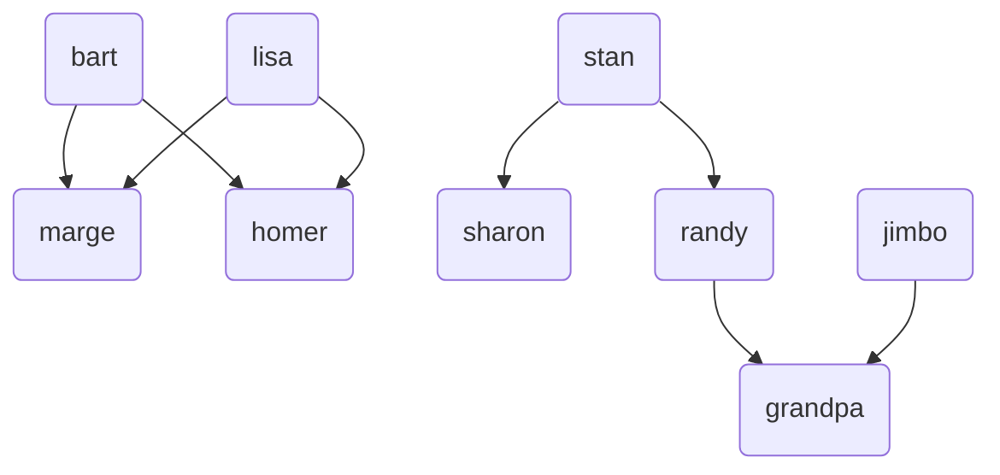
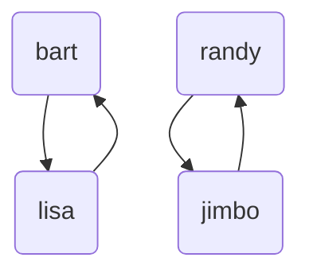
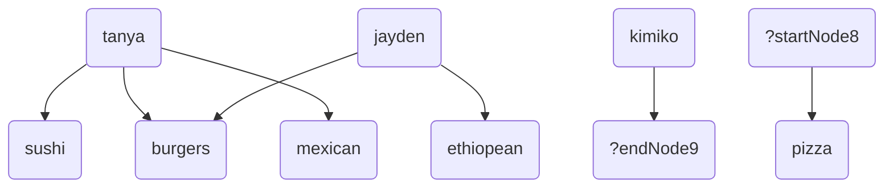
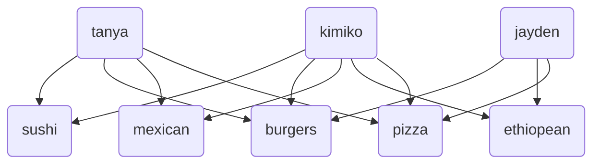

Predicates that take two parameters are sometimes called *binary predicates*.  A useful debugging tool for binary predicates is that we visualize them as [graphs](graphs), i.e. networks of nodes with lines or arrows between them.  If `[Predicate a b]` is true, then we include `a` and `b` with an arrow from `a` to `b`.  For example, for our family example:
```step
[predicate]
Siblings ?a ?b: [Parent ?a ?parent] [Parent ?b ?parent] [Different ?a ?b]

[predicate]
Parent bart marge.
Parent bart homer.
Parent lisa homer.
Parent lisa marge.
Parent stan sharon.
Parent stan randy.
Parent randy grandpa.
Parent jimbo grandpa.
```
The `Parent` predicate looks like this:

and the `Siblings` predicate looks like this:

You can generate these visualizations yourself using the `VisualizeGraph` task.  Simply say `[VisualizeGraph ?predicate]`, where `?predicate` is some predicate that takes 2 arguments and it will draw the graph in your browser.  Try it out:
```Step
# Try: [VisualizeGraph Parent]
[predicate]
Siblings ?a ?b: [Parent ?a ?parent] [Parent ?b ?parent] [Different ?a ?b]

[predicate]
Parent bart marge.
Parent bart homer.
Parent lisa homer.
Parent lisa marge.
Parent stan sharon.
Parent stan randy.
Parent randy grandpa.
Parent jimbo grandpa.
```

## Unbound variables in visualizations

Returning to our food preferences example:
```Step
# Try: [VisualizeGraph Likes]
[predicate]
Likes tanya sushi.
Likes tanya burgers.
Likes tanya mexican.
Likes jayden burgers.
Likes jayden ethiopean.
# Kimiko likes everything
Likes kimiko ?.
# Everyone likes pizza.
Likes ? pizza.
```
When we visualize it, we get the somewhat odd visualization:

Where we have graph nodes like `?startNode8` and `?endNode9` that are variables rather than real values.  That's because of rules like:
```step
# Kimiko likes everything
Likes kimiko ?.
```
which mean that when you ask for all solutions to `[Likes ?startNode ?endNode]`, which is what the graph visualizer does, one of the solutions you get is `?startNode = kimiko, ?endNode=?`, i.e. `?endNode` can be anything, i.e. "Kimiko likes everything".  But of course, the intention isn't that Kimiko doesn't like *everything*.  Kimiko may not like nuclear war, for example.  The intention of the rule above means "Kimiko likes all *foods*" and so the variable there is intended only to be used with foods.  But the system doesn't have a list of all foods, so it doesn't know what to do with the variable and it just renders it as `?endNode9`.

We can fix this buy giving it explicit generators for the set of characters and the set of foods.  We can say that someone is a character if they like something and food if it's liked by someone:
```step
[predicate]
Character ?who: [Likes ?who ?] [NonVar ?who]
[predicate]
Food ?what: [Likes ? ?what] [NonVar ?what]
```
The [`NonVar`](testing_binding_status) predicate, which we'll talk about later, says only to accept the result if `?who` has a value.  That filters out the results from the `Likes` rules that have `?`s in them.

Then we can have a version of `Likes` that never returns variables in its queries:
```step
[predicate]
LikesExhaustive ?who ?what: [Likes ?who ?what] [Character ?who] [Food ?what]
```
And then we get the full visualization:

This is "better" in the sense that it explicitly shows all combinations of who liking what.  But it's also a mess, so you might prefer the version with variables.

You can try it out:
```Step
# Try: [VisualizeGraph LikesExhaustive]
[predicate]
Likes tanya sushi.
Likes tanya burgers.
Likes tanya mexican.
Likes jayden burgers.
Likes jayden ethiopean.
# Kimiko likes everything
Likes kimiko ?.
# Everyone likes pizza.
Likes ? pizza.

[predicate]
Character ?who: [Likes ?who ?] [NonVar ?who]
[predicate]
Food ?what: [Likes ? ?what] [NonVar ?what]
[predicate]
LikesExhaustive ?who ?what: [Likes ?who ?what] [Character ?who] [Food ?what]
```