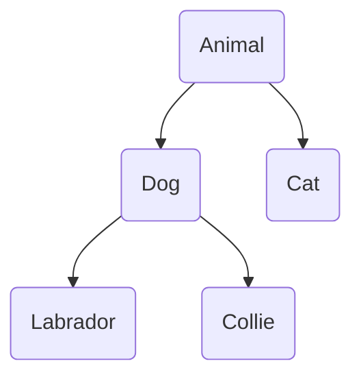

Taxonomic relationships come up a lot in games.  Dogs and cats are kinds of animals, Collie and Labrador are kinds of dogs:

We can express those relationships using rules:
```Step
# Try: [Animal lassie]
[predicate]
Animal ?a: [Dog ?a]
Animal ?a: [Cat ?a]

[predicate]
Dog ?d: [Labrador ?d]
Dog ?d: [Collie ?d]

[predicate]
Collie lassie.
[predicate]
Labrador bruce.
```
Now suppose we run `[Animal lassie]`, i.e. we ask “is Lassie an animal?”  The system has to choose an `Animal` method, then based on that method, either a `Dog` method of a `Cat` method.  If a `Dog` method, then it has to choose either a `Collie` method or a `Labrador` method.  We assume it always makes good choices, and the of the first `Animal` method (dog) followed by the second `Dog` method (collie) works.  In so doing it's basically concluded that Lassie is an Animal because:

* Lassie is a collie
* Collies are dogs
* Dogs are animals

We could instead have run `[Animal ?x]`, meaning “who’s an animal?”  Then it would find an animal.  Since the predicates aren't tagged with `[randomly]`, it would always choose the first methods, and so say `bruce`.


