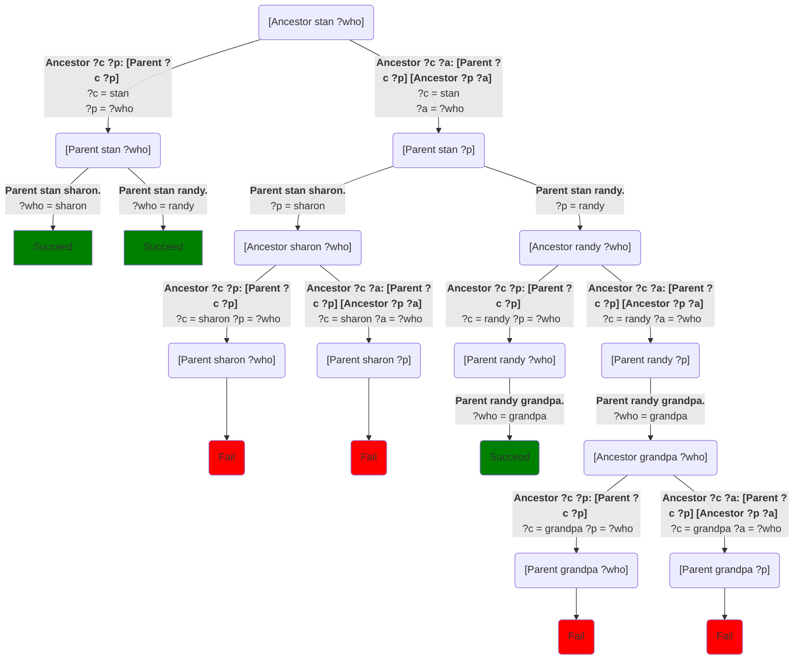
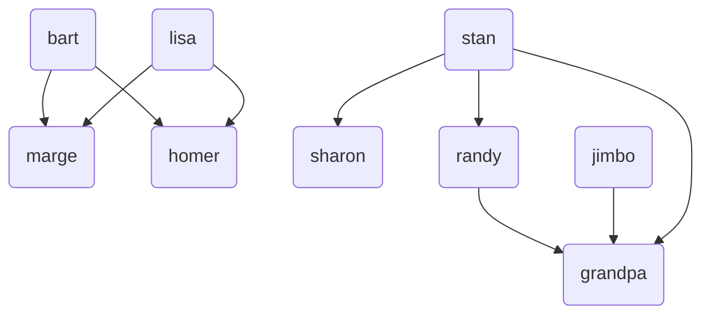
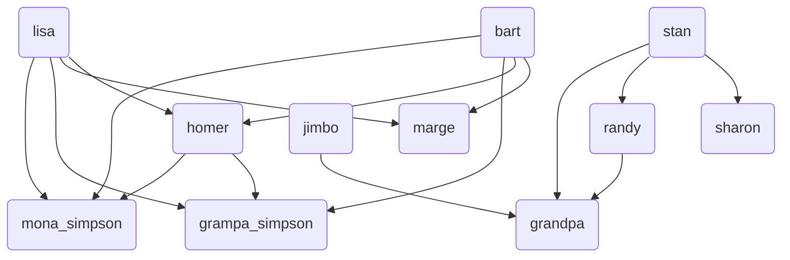

So far, so good.  We can define the `Parent` relationship and then define most everything else in terms of that: grandparents and grandchildren, great-grandparents, siblings, etc. But what about ancestors?  An ancestor is your parent or grandparent or great-grandparent or great, great-grandparent, etc.  We could write:
```step
[predicate]
Ancestor ?c ?a: [Parent ?c ?a]
Ancestor ?c ?g: [Grandparent ?c ?g]
Ancestor ?c ?g: [Greatgrandparent ?c ?g]
Ancestor ?c ?g: [Greatgreatgrandparent ?c ?g]
```
And so on, forever.  But forever is a lot of typing.

What we can do instead, that doesn't involve literally typing for eternity, is to define an ancestor as either:

* Your parent, or
* An ancestor of your parent.

We can write that in Step using just two rules that do the equivalent work of an infinite number of rules:
```step
[predicate]
Ancestor ?c ?p: [Parent ?c ?p]
Ancestor ?c ?a: [Parent ?c ?p] [Ancestor ?p ?a]
```
Let's look at how this runs with our little database of cartoon characters:
```Step
# Try: [Ancestor stan ?who]
[predicate]
Ancestor ?c ?p: [Parent ?c ?p]
Ancestor ?c ?a: [Parent ?c ?p] [Ancestor ?p ?a]

[predicate]
Parent bart marge.
Parent bart homer.
Parent lisa homer.
Parent lisa marge.
Parent stan sharon.
Parent stan randy.
Parent randy grandpa.
Parent jimbo grandpa.
```
The choice tree for this is more involved, but it gives us the right answers, sharon, randy, and grandpa:

We can also visualize it and it's correct:

You can check this yourself by running `[VisualizeGraph Ancestor]` in the code above.  Because of our little database, this is almost the same as the visualization of `Parent`, but it adds the arrow from `stan` to `grandpa`.  If we add Homer Simpson's parents[^marge]: 
```Step
# Try: [VisualizeGraph Ancestor]
[predicate]
Ancestor ?c ?p: [Parent ?c ?p]
Ancestor ?c ?a: [Parent ?c ?p] [Ancestor ?p ?a]

[predicate]
Parent bart marge.
Parent bart homer.
Parent lisa homer.
Parent lisa marge.
Parent homer grampa_simpson.   # new
Parent homer mona_simpson.     # new
Parent stan sharon.
Parent stan randy.
Parent randy grandpa.
Parent jimbo grandpa.
```
then we get a slightly bigger graph:

Note that while the [mermaid.js graph renderer](https://mermaid.js.org/) used here places Jimbo so as to look like he's part of the Simpson family, he isn't, and the arrows from Lisa and Bart to Homer and Marge just happen to cross over his node.  They aren't actually connected to him.


## Recursion

In mathematics, logic, and computer science, self-referential definitions like this are said to be **recursive**[^inductive], and when the `Ancestor` rule turns around and calls `Ancestor` again, that’s called **recursion**.  

### How to write a recursive predicate

Recursive predicates have a fairly standard format:

* They start with a rule that doesn’t recurse (doesn't call the predicate we're defining).  This is called a **base case**.  It notices when it can decide immediately without having to recurse. 
* Then there’s another rule called, unsurprisingly, the **recursive case**, that ends with a recursive call (a call to the predicate being defined).

Note that you can run into problems if you put the rules in the opposite order, or tag them `[randomly]`.  In this case, it would work.  But there are cases where it doesn't.  We'll talk more about this later.  

## Notes

[^inductive]: *Esoteric*: Sometimes self-referential rules are called *inductive* rather than *recursive*.  The distinction is that recursions start with the complex case and move to the base case and inductions move from the base case to the complex case.  Self-referential functions are usually described as recursive, whereas self-referential data structures are usually described as inductive.

[^marge]: Again, I'd add Marge's parents too, but I can't find any record of them.