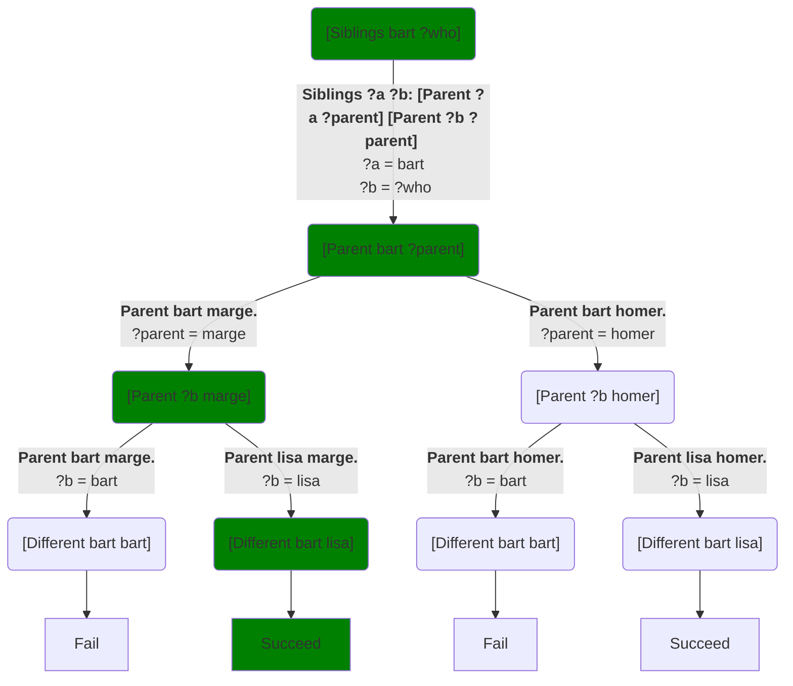

Let's return to our [`Siblings`](inference) example:
```Step
# Try: [Siblings bart ?who]
[predicate]
Siblings ?a ?b: [Parent ?a ?parent] [Parent ?b ?parent] [Different ?a ?b]

[predicate]
Parent bart marge.
Parent bart homer.
Parent lisa homer.
Parent lisa marge.
Parent stan sharon.
Parent stan randy.
Parent randy grandpa.
Parent jimbo grandpa.
```
When we run `[Siblings bar ?who]`, the system calls `Siblings`, whose method then calls parent twice.  There's only once choice for `Siblings` method, but multiple choices for each `Parent` call, yielding the following choice tree that we've seen before.  I've recolored the nodes to highlight a particular choice path:

The path shown in green is the path it will choose unless the predicates are tagged with `[randomly]`.  When executing this path, the system performs the following operations:

* Call: **`[Siblings bart ?who]`**
* Match it to: **`Siblings ?a ?b: [Parent ?a ?parent] [Parent ?b ?parent] [Different ?a ?b]`**
* Call:  **`[Parent ?a ?parent]`**
* Match that call to: **`Parent bart marge.`**
* Call: **`[Parent ?b ?parent]`**
* Match it to: **`Parent lisa marge.`**
* Call:: **`[Different ?a ?b]`

## Variable binding over time

Local variables --- `?a`, `?who`, etc. --- only acquire values through matching.  So before calling `[Siblings bart ?who]`, the local variable `?who` has no value; it's said to be **unbound**.[^1]  All local variables begin life unbound.  So as a program executes, we typically see variables gradually get bound to values.  Here is a table of the bindings of the different variables in the execution path discussed above, as each call is matched to its selected method.  Each column shows the states of the variables just after its call has been matched to a method, but before that method has started any of its own calls:

| Variable  | Before execution | `[Siblings bart ?who]` matched | `[Parent ?a ?parent]` matched | `[Parent ?b ?who]` matched |
| --------  | -----------------| ----------------------------   |------                         | ---                        |
| `?who`    |                  |                       |                        | `lisa` |
| `?a`      |                  | `bart`                         | `bart`                        | `bart` |
| `?b`      |                  |                        |                        | `lisa` |
| `?parent` |                  |                                | `marge`                       | `marge` |
| *Connections* | | *`?who` = `?b`* | *`?who` = `?b`* | *`?who` = `?b`* |

## Why it matters

Most of the time, you can ignore these issues.  However, there are times when Step does some action based on the current state of a variable *rather than the final state it will have when program finishes execution*.  The example of that you can see now is when you print the variable.  Suppose we modify the code above to print the values of `?b` and `?parent` during the execution of `Siblings`:
```Step
# Try: [Siblings bart ?who]
[predicate]
Siblings ?a ?b:
   Before calls: ?b ?parent.
   [Parent ?a ?parent]
   After first call: ?b ?parent.
   [Parent ?b ?parent]
   After second call: ?b ?parent.
   [Different ?a ?b]
[end]

[predicate]
Parent bart marge.
Parent bart homer.
Parent lisa homer.
Parent lisa marge.
Parent stan sharon.
Parent stan randy.
Parent randy grandpa.
Parent jimbo grandpa.
```

It prints something like the following.  Don't worry about the fact that the system added numbers to the ends of the variables' names:[^2]

> Before calls: *?who0 ?parent3*.  After first call: *?who0* marge.  After second call: lisa marge.

It's printing *exactly the same variables* each time.  However, printing captures a variable's state at the moment of printing.  So this example makes visible the variables' progression from being unbound to bound.

Similar issues will come up when we talk about [primitive tasks and predicates](primitive_tasks).  For example, it's not obvious what answer `Different` should return if we call it with two different unbound variables, as in `[Different ?a ?b]`.  Should it succeed because they're different variables, or fail because they might become equal in the future?

## Notes

[^1]: The term **uninstantiated** is more often used in the logic programming literature.  We'll use the term **unbound** both because it's arguably more descriptive, and also because the way logic variables work is really rather different from the [instantiation in logic](https://en.wikipedia.org/wiki/Universal_instantiation), so the use of the term is arguably inappropriate anyway.

[^2]: The numbers are there because you might have 100 different local variables named `?parent` in a program.  They're different variables, generally with different values, that just happen to share a name.  To help you tell when two things that print as `?parent` are the same, the system assigns serial numbers to them and prints the serial number along with its normal name.