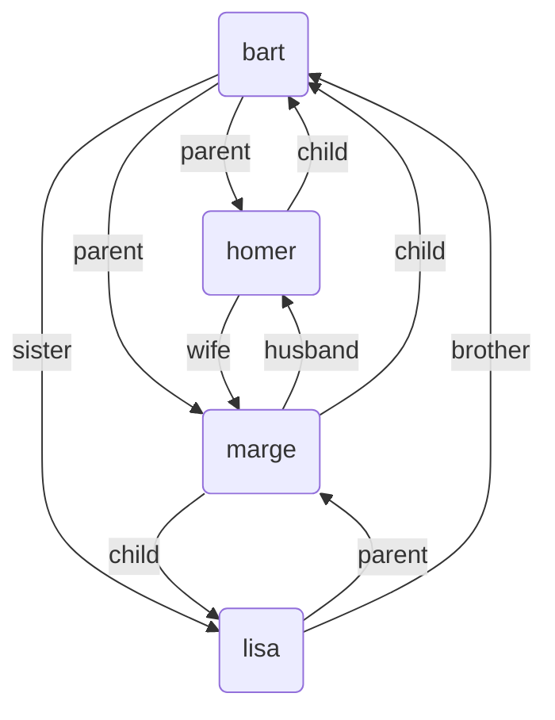
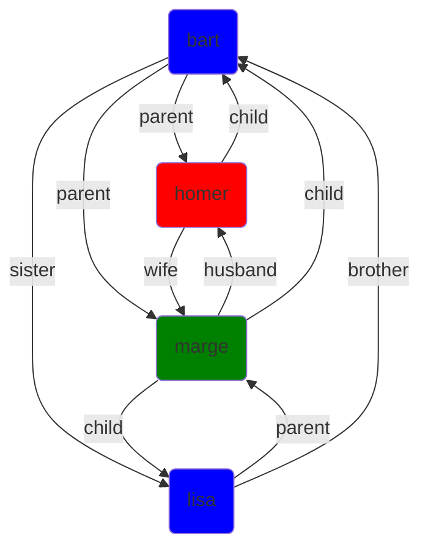
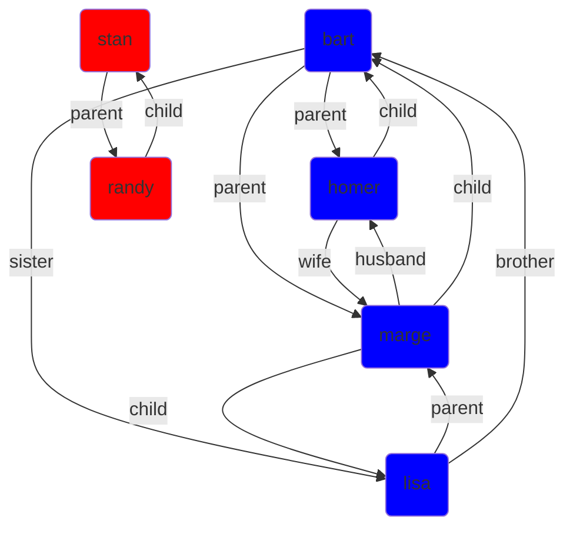

There are a number of primitive tasks that print.  You've already seen `Write` but here's the full list:

* `[Write `*x*`]`  
Prints *x*.  Any '_' characters contained in strings are changed to spaces.  Unbound variables, tuples, feature structures print in the form you would see them in code.  It is printed as a separate word, and so in the final text generation, it is separated from whatever was previously printed by a space, except in limited circumstances such as if it comes after an open quote or if what we're printing is a close quote.
* `[WriteVerbatim `*x*`]`  
Identical to `Write`, but does not change '_' characters in strings to spaces.
* `[WriteCapitalized `*x*`]`  
Identical to `Write` except the first character is converted to upper case.
* `[WriteConcatenated `*x*`  `*y*`]`  
Identical to `Write` but prints both *x* and *y* without any space between them.
* `[NewLine]`  
Starts a new line.
* `[FreshLine]`  
Starts a new line unless we're already at the start of a line.
* `[Paragraph]`  
Starts a new paragraph.

These primitives are all deterministic.  And for most purposes they operate only in **input mode** in the sense that if you call them with a variable, it prints the variable rather than giving a value to it.  However, when [parsing text](parse_predicate), they flip from being input mode and printing, to being output mode and reading from the input string.  See [parsing text](parse_predicate).

## Graph output (not supported in all environments)

Graph visualization isn't part of the core Step interpreter, but it's supported both on the web interface and the Step IDE (StepRepl), since it's very useful for debugging.  As we [discussed earlier](visualizing_predicates), you can print a graph using the `VisualizeGraph` task:
```step
[VisualizeGraph ?predicate]
```
which finds all solutions to `[?predicate ?start ?end]` and makes a graph with an edge (arrow) for each solution, adding nodes as needed.  

### Labeling the edges (arrows)

This assumes `?predicate` takes two parameters.  It it takes three parameters, it label the edge with the value of the third argument.  For example:
```Step
# Try: [VisualizeGraph Relationship]
[predicate]
Relationship bart homer parent.
Reltionship lisa home parent.
Relationship bart marge parent.
Relationship lisa marge parent.
Relationship homer marge wife.
Relationship marge homer husband.
Relationship bart lisa sister.
Relationship lisa bart brother.
# If ?parent is ?child's parent, then ?child is ?parent's child
Relationship ?parent ?child child: [Relationship ?child ?parent parent]
```
which yields the graph:


### Coloring the nodes

You can specify optional extra keyword parameters for other options.  To change the colors of the nodes, say:
```step
[VisualizeGraph ?predicate node_color ?colorTask]
```
where `?colorPredicate` is a predicate that specifies what colors nodes should have.  Here keyword `node_color` tells it that the next value is the task to use to get colors of nodes.

This may be best explained with an example:
```Step
# Try: [VisualizeGraph Relationship node_color CharacterColor]
[predicate]
Relationship bart homer parent.
Reltionship lisa home parent.
Relationship bart marge parent.
Relationship lisa marge parent.
Relationship homer marge wife.
Relationship marge homer husband.
Relationship bart lisa sister.
Relationship lisa bart brother.
# If ?parent is ?child's parent, then ?child is ?parent's child
Relationship ?parent ?child child: [Relationship ?child ?parent parent]

CharacterColor homer red.
CharacterColor marge green.
CharacterColor ? blue.  # everybody else is blue.
```
Then we get:

Basically, when it wants to render a node, it calls `?colorTask`, passing it the node as its first parameter, and then reads back the color as the value of the second parameter.  The colors should be color strings that the web understands like "red", "blue", etc.

### Other options

`VisualizeGraph` accepts other keyword arguments:

* `roots ?nodePredicate`  
Includes as nodes all the solutions to `[?nodePredicate ?node]` and any nodes reachable from them via arrows.
* `node_label ?labelTask`  
Like `node_color` but instead of using the task to get the color of the node, it uses it to get the text to display in the node.
* `directed ?boolean`
If true, edges are drawn as arrows.  If not, they're drawn as lines.  Default is true.
* `style ?string`
Passes `?string` as the style to the Mermaid graph renderer.  The default is `"graph TD"`, which means to draw it as a normal graph, running top-to-bottom.  For some graphs, you may prefer `"graph LR`", which runs left-to-right.
* `color_components ?boolean`  
If `?boolean` is true, override the coloring of nodes so that all nodes within a given connected component have the same color.  So if we add Stan Marsh and Randy Marsh to the list of characters:
```Step
# Try: [VisualizeGraph Relationship color_components true]
[predicate]
Relationship bart homer parent.
Reltionship lisa home parent.
Relationship bart marge parent.
Relationship lisa marge parent.
Relationship homer marge wife.
Relationship marge homer husband.
Relationship bart lisa sister.
Relationship lisa bart brother.

Relationship stan randy parent.

# If ?parent is ?child's parent, then ?child is ?parent's child
Relationship ?parent ?child child: [Relationship ?child ?parent parent]
```
Then the Marsh family will appear in one color and the Simpsons in another:
