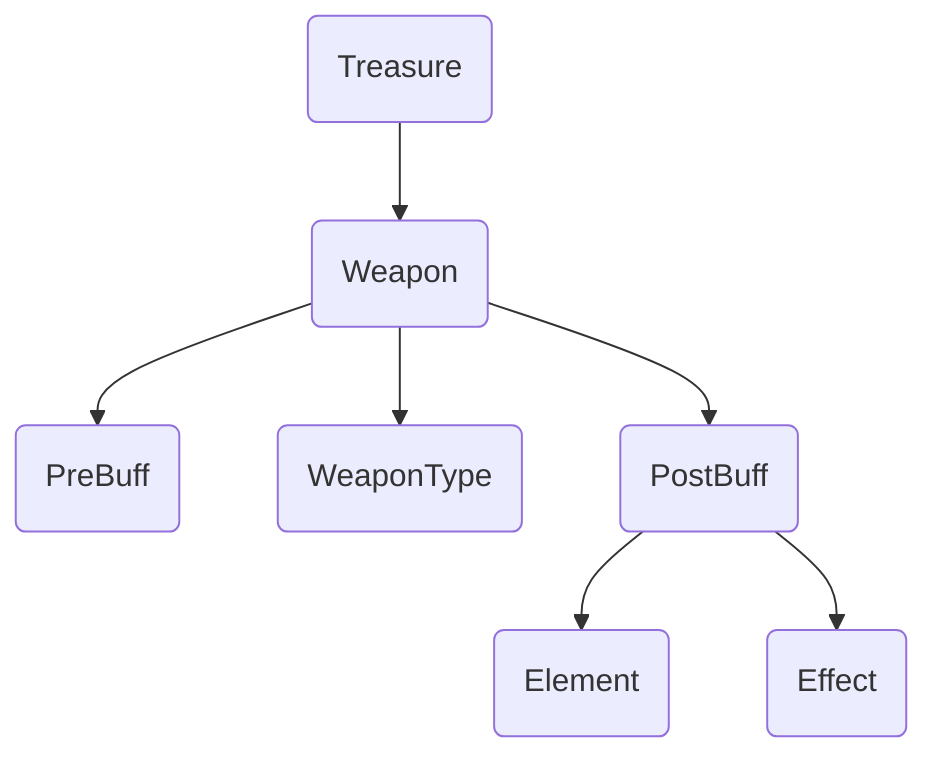
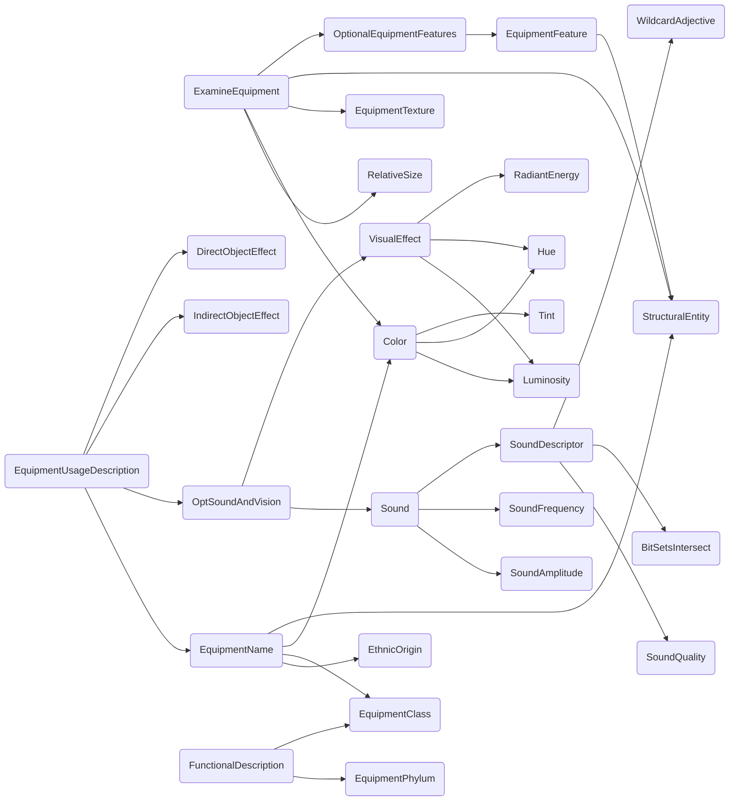

Arguably, the single most useful static reflection call is `[VisualizeGraph TaskCalls]`, which shows you a map of your program and what calls what.  For our treasure grammar, that gives us the diagram:

Give it a try:
```Step
# Try: [VisualizeGraph TaskCalls]
Treasure: [Weapon]

Weapon: [PreBuff] [WeaponType] [PostBuff]

[randomly]
WeaponType: sword
WeaponType: mace

[randomly]
PreBuff: +1
PreBuff: +2
PreBuff: cursed

[randomly]
PostBuff: of [Element]
PostBuff: of [Effect]

[randomly]
Element: earth
Element: air
Element: fire
Element: water
Element: soul

[randomly]
Effect: insanity
Effect: sleep
Effect: poison
Effect: social anxiety
```
The *Starflight* grammar is considerable more complicated:

Again, give it a try:
```Step
# Try: [VisualizeGraph TaskCalls style "graph LR"]
###
### TOP-LEVEL COMMANDS
### Try one of these three
###
# Generates the text for the EXAMINE command when examining equipment
ExamineEquipment: [RelativeSize] [Color] [EquipmentTexture] [StructuralEntity] [OptionalEquipmentFeatures]
# Generates text for the USE command when using equipment that isn't the analyzer
EquipmentUsageDescription: using [EquipmentName]. [OptSoundAndVision] [IndirectObjectEffect] [DirectObjectEffect]
# Generates text for the USE command when using the analyzer
FunctionalDescription: [randomly] [EquipmentPhylum] [or] [EquipmentClass ?] [end]

###
### EQUIPMENT DESRCIPTIONS
###

[randomly]
EquipmentName: [EthnicOrigin] [EquipmentClass ?]
EquipmentName: [EthnicOrigin] [Color] [StructuralEntity]

[randomly]
EquipmentClass weapon: [randomly]knife [or] sling [or] sword [or] rock [or] stun projector [or] club [or] needler [or] darts [or] web gun [or] boomerang [or] laser pistol [or] magnum [or] laser rifle [or] projectile gun [or] sonic rifle [or] thrip gun [or] stun grenade [or] shtoltac rifle [or] plasma grenade [or] light saber [or] mortar [or] ecstasy orb [or] bolo [or] focusing cone [or] flail [or] black egg [or] bow [or] spear [or] pike [or] javelin [end]
EquipmentClass vehicle: [randomly] skimmer [or] floater [or] hovercraft [or] landcrawler [or] ice clipper [or] robowalker [or] ornithopter [or] gyrocopter [or] landsphere [or] vacuum lifter [or] stratocruiser [or] groundleaper [or] centipede [or] dirigible [or] glider [or] sandship [or] boat [or] triwheel [end]
EquipmentClass sensor: [randomly] bioscanner [or] masscanner [or] function analyzer [or] image amplifier [or] endurium sensor [end]
EquipmentClass communication: universal translator
EquipmentClass life_support: [randomly] food processor [or] light duty environment suit [or] medium duty environment suit [or] heavy duty environment suit [or] medikit[end]
EquipmentClass general: [randomly] mining gear [or] alien repellent spray [or] malthusian muk-muk [or] assorted gems [or] denebian fire wine [or] synthi-harp [or] plastic beads [or] holo-imager [or] beef jerky [or] sun glasses [or] tanning lotion [or] gummy bears [or] boom box [or] starflight game [or] mystery box [end]

EquipmentPhylum: [randomly] weapon [or] vehicle [or] sensor [or] communication [or] life support [or] general [end]

[randomly]
OptionalEquipmentFeatures: with [EquipmentFeature]
OptionalEquipmentFeatures: with [EquipmentFeature] and [EquipmentFeature]
OptionalEquipmentFeatures.

EquipmentFeature: [StructuralEntity]

EquipmentTexture: [randomly] pyramid shaped [or] cylindrical [or] diamond shaped [or] square [or] hexagonal [or] circular [or] triangular [or] finely sculptured [or] cuboid [or] round [or]  [or] octagonal [or] oval [or] bowl shaped [or] cupped [or] dish shaped [or] disk shaped [or] armoured [or] retractible [or] blade-like [or] saucer shaped [or] spiral [or] spiked [or] needle shaped [or] blunt [or] conical [or] razor sharp [or] sharp [or] flexible [or] spear shaped [or] rod shaped [or] pronged [or] pointed [or] spherical [or] dome shaped [or] tear shaped [or] very intricate [or] curved [or] irregular [or] jointed [or] powerful-looking [or] stubby [end]

EthnicOrigin: [randomly] old empire [or] elowan [or] thrynn [or] veloxi [or] mechan [or] spemin [or] gazurtoid [or] seeayti [or] ulek [or] phlegmak [or] jaggn [or] numlox [or] xystythyx [end]

RelativeSize: [randomly] wee  [or] tiny  [or] very small  [or] small  [or] big  [or] large  [or] very large [or] huge [or] massive [or] humongous [or] gargantuan [end]

StructuralEntity: [randomly] blob [or] dial [or] window [or] sphere [or] light [or] seat [or] globe [or] meter [or] control [or] orb [or] lens [or] door [or] dome [or] hole [or] engine [or] cylinder [or] grid [or] coil [or] rod [or] ridge [or] fin [or] bar [or] wire [or] hull [or] cone [or] screen [or] antennae [or] pyramid [or] display [or] membrane [or] cube [or] handle [or] box [or] wheel [or] polyhedron [or] tread [or] tube [or] blade [or] button [or] trigger [or] lever [or] rotor [or] switch [or] wing [or] knob [or] sail [end]

###
### EFFECT DESCRIPTIONS
###

# I'm leaving these blank because it's too hard to figure out what's supposed to happen from the documentation.
IndirectObjectEffect.
DirectObjectEffect.

[randomly]
OptSoundAndVision: there is [a] [randomly] [Sound] [or] [VisualEffect] [or] [Sound] and [a] [VisualEffect] [end].
OptSoundAndVision.

VisualEffect: [randomly] [Luminosity] [or] [end] [randomly] [Hue ?] [or] [end] [RadiantEnergy]
RadiantEnergy: [randomly] beam of energy [or] flash of light [or] bright glare [end]

###
### SOUND
###

Sound: [SoundAmplitude] [SoundFrequency ?freq] [SoundDescriptor ?freq]

[randomly]
SoundDescriptor ?freq: [randomly] [SoundQuality ?bits] [BitSetsIntersect ?freq ?bits] [or] [WildcardAdjective ?bits] [BitSetsIntersect ?bits 0b01000000] [or] [end] sound
SoundDescriptor ?: [randomly] noise [or] blast [or] roar [end]

SoundAmplitude: [randomly] loud [or] faint [or] thunderous [or] deafening [end]

[randomly]
SoundFrequency 0b01000000: high pitched
SoundFrequency 0b00100000: low pitched
SoundFrequency 0b01100000.

[randomly]
SoundQuality 0b00011110: explosive  
SoundQuality 0b00111010: booming    
SoundQuality 0b00111010: funky      
SoundQuality 0b00111010: pounding   
SoundQuality 0b00111010: rumbling   
SoundQuality 0b00111011: resonating 
SoundQuality 0b01010010: ringing    
SoundQuality 0b01110110: sizzeling  
SoundQuality 0b01111010: mechanical 
SoundQuality 0b10000000: flapping   
SoundQuality 0b10000000: whispering 
SoundQuality 0b10010000: chattering 
SoundQuality 0b10010000: crashing   
SoundQuality 0b10010000: crackling  
SoundQuality 0b10010000: howling    
SoundQuality 0b10010000: snapping   
SoundQuality 0b10010010: clicking   
SoundQuality 0b10010010: crunching  
SoundQuality 0b10010010: popping    
SoundQuality 0b10010010: tapping    
SoundQuality 0b10010010: whoosing   
SoundQuality 0b10010010: buzzing    
SoundQuality 0b10100000: cooing     
SoundQuality 0b10100010: murmuring  
SoundQuality 0b10110000: growling   
SoundQuality 0b10110000: thumping   
SoundQuality 0b10110010: drumming   
SoundQuality 0b10110010: grinding   
SoundQuality 0b10110010: purring    
SoundQuality 0b10110010: thrumming  
SoundQuality 0b10111010: roaring    
SoundQuality 0b11010000: cackling   
SoundQuality 0b11010000: chirping   
SoundQuality 0b11010000: screaching 
SoundQuality 0b11010000: sqeeeling  
SoundQuality 0b11010010: whining    
SoundQuality 0b11010010: whistling  
SoundQuality 0b11010110: piercing   
SoundQuality 0b11010110: screaming  
SoundQuality 0b11100010: musical    
SoundQuality 0b11110010: humming    
SoundQuality 0b11110110: hissing

###
### COLOR
###

# Original source:
# color = luminosity:(luminosity " ")1 pure hue : (tint " ")1 pure hue: mixed hue
[randomly]
Color: [Luminosity]
Color: [Luminosity] [Hue pure]
Color: [Tint] [Hue pure]
Color: [Hue mixed]

Tint: [randomly] dark [or] light [or] grey [end]

Luminosity: [randomly] blinding [or] bright [or] glowing [or] luminescent [or] translucent [or] shimmering [end]

# Starflight used a table of hues with a separate marker for which were mixed and pure.
[randomly]
Hue pure:  red
Hue mixed: chartruse
Hue mixed: magenta
Hue mixed: greenish brown
Hue mixed: maroon
Hue pure:  green
Hue mixed: puce
Hue mixed: lime green
Hue mixed: rust colored
Hue pure:  blue green
Hue mixed: pink
Hue mixed: turquoise
Hue pure:  redish orange
Hue pure:  blue
Hue mixed: brass colored
Hue mixed: lavender
Hue mixed: brown
Hue pure:  violet
Hue mixed: beige
Hue pure:  purple
Hue mixed: copper colored
Hue mixed: obnoxious purple
Hue pure:  orange
Hue mixed: mauve
Hue pure:  yellowish orange
Hue mixed: many colored
Hue pure:  yellow
Hue mixed: white
Hue pure:  lemon yellow
Hue mixed: black
Hue pure:  yellowish green

###
### MISC
###

WildcardAdjective 0b01010000:  bitchin'
WildcardAdjective 0b10110000:  mondo
WildcardAdjective 0b11010000:  groovy
WildcardAdjective 0b10000000:  grody
WildcardAdjective 0b10000000:  nauseating
WildcardAdjective 0b11110000:  outrageous
WildcardAdjective 0b11110000:  totally radical
WildcardAdjective 0b10110000:  awesome
WildcardAdjective 0b01000000:  edifying
WildcardAdjective 0b01000000:  uplifting
WildcardAdjective 0b10000000:  grotesque
WildcardAdjective 0b10100000:  bodacious
WildcardAdjective 0b01000000:  funkadelic
WildcardAdjective 0b10000000:  gorgeous
WildcardAdjective 0b10000000:  seductive
WildcardAdjective 0b11110000:  beautiful
WildcardAdjective 0b10110000:  incredible
```
You can use this to get an overview of any program.