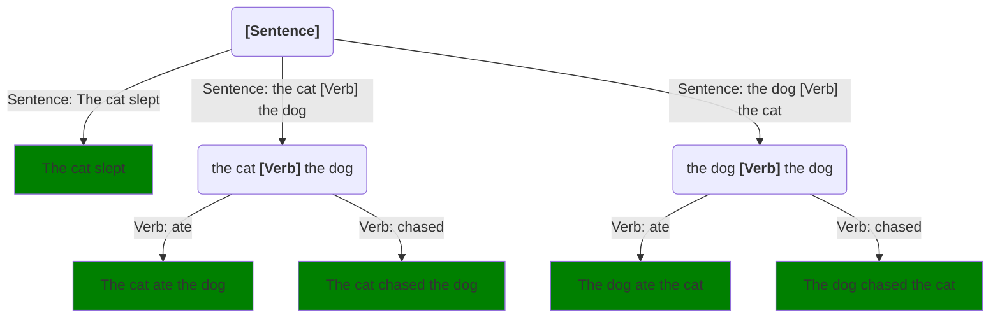

Step is a variation of what Alan Turing called a *choice machine*.[^1]  When we run a Step program, the machine makes a series of calls, and for each call it may have a choice of several different methods.  For example, here's a slight variation on our Sentence generator:
```step
# Try: [Sentence]
[randomly]
Sentence: The cat slept
Sentence: the cat [Verb] the dog
Sentence: the dog [Verb] the cat

[randomly]
Verb: ate 
Verb: chased 
```
When running `[Sentence]`, the system must choose:

* Which method of `Sentence` to use, and
* Which method of `Verb` to use, if our chosen `Sentence` method calls `Verb`

We can diagram the choices and the outputs they produce.  The rounded boxes are calls, the green square boxes are the final outputs.  And the arrows are labeled with the different methods that can be chosen for the call:

We'll call this a **choice tree**.  Different sequences of choices -- different **choice paths** -- produce different outputs, shown here in green.  We'll use green in these diagrams to indicate the ends of **successful** choice paths, and red to indicate **failed** ones.  For the moment, all paths are green because there's nothing that can fail.


## Notes

[^1]: [Turing, A. M. *On Computable Numbers, with an Application to the Entscheidungsproblem."](https://londmathsoc.onlinelibrary.wiley.com/doi/abs/10.1112/plms/s2-42.1.230).