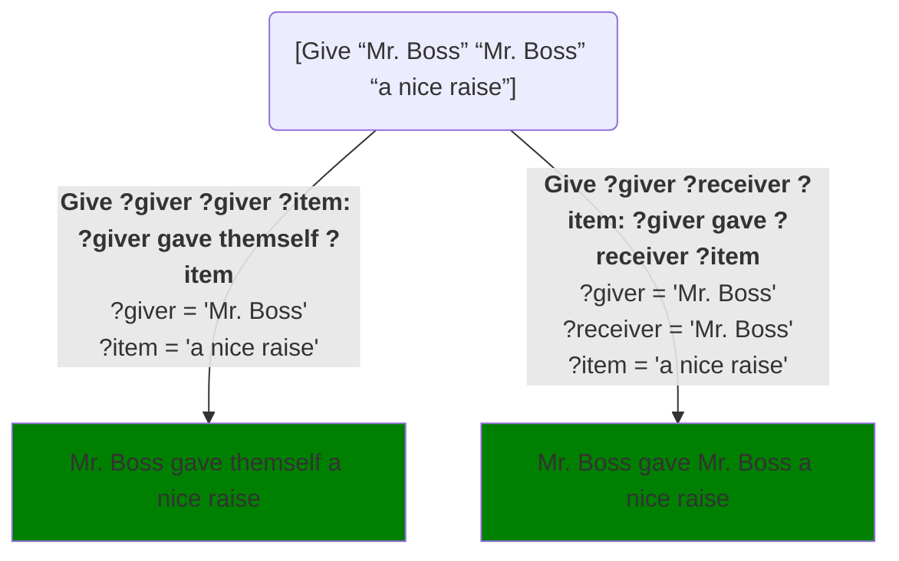
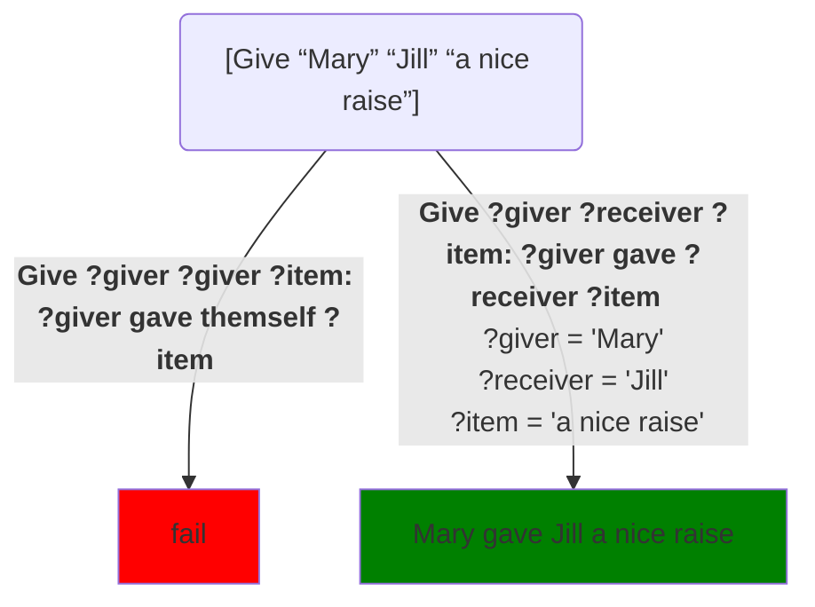

Suppose we want to have a phrase/task that prints out statements of the form `?a gave ?b the ?c`.  We could do this with a task with three parameters:
```Step
# Try: [Give “Mary” “Jill” “a red rose”]
Give ?giver ?receiver ?item:
   ?giver gave ?receiver ?item.
[end]
```
If you then say:
```step
[Give “Mary” “Jill” “a nice raise”]
```
it responds:

> Mary gave Jill a nice raise

But if we say:
```step
[Give “Mr. Boss” “Mr. Boss” “a nice raise”]
```
it responds:

> Mr. Boss gave Mr. Boss a nice raise.

Which isn’t fluent.  How could we fix this?

## Detecting self-dealing

We can fix it by having another method that is only used when someone gives something **to themself**:
```Step
# Try: [Give “Mr. Boss” “Mr. Boss” “a nice raise”]
Give ?giver ?giver ?item: ?giver gave themself ?item
Give ?giver ?receiver ?item: ?giver gave ?receiver ?item
```
Let's diagram the choices here.  Again, the rounded boxes are calls and the square green boxes are final results.  But now the arrows are labeled not only with the method that's chosen, but with the values it assigns to the variables:

If we had tagged `Give` with `[randomly]`, then it would randomly choose between the two outputs shown in green.  **Since we didn't randomize `Give`, Step will always prefer to choose methods that come earlier in the program over ones that come later**.  That means Step will always choose the *leftmost* solution path in the diagram.[^1]  In this case, that means it generates:

> Mr. Boss gave themself a nice raise

But in the Mary/Jill example, the parameters can’t match to that first method because `?giver` would have to somehow be both Mary and Jill at the same time.  So we say that that method "**fails**":

Since the first method would fail, it has to choose the second, resulting in:

> Mary gave Jill a nice raise

## Notes

[^1]: I'll adopt the convention of always putting earlier methods on the left in the diagrams, and later ones on the right.  So for unrandomized methods, the solution Step chooses will always be in the leftmost position of a diagram.