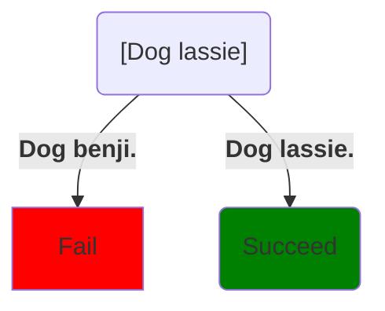
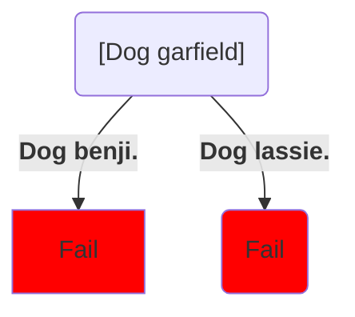
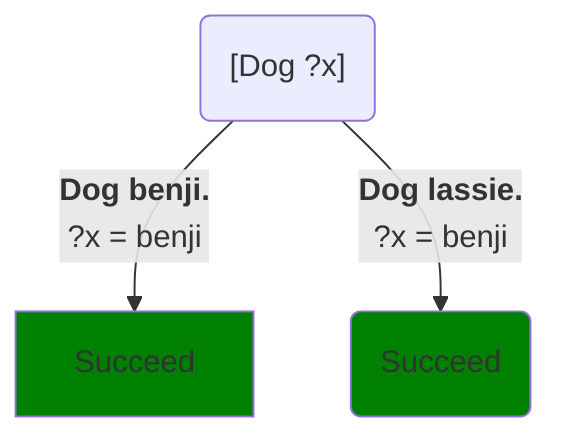
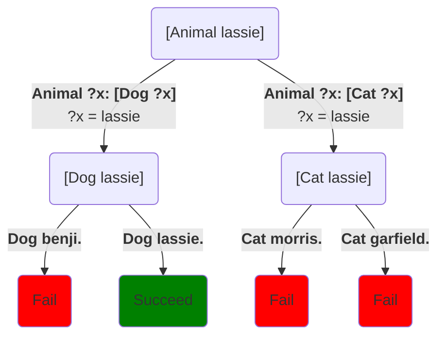
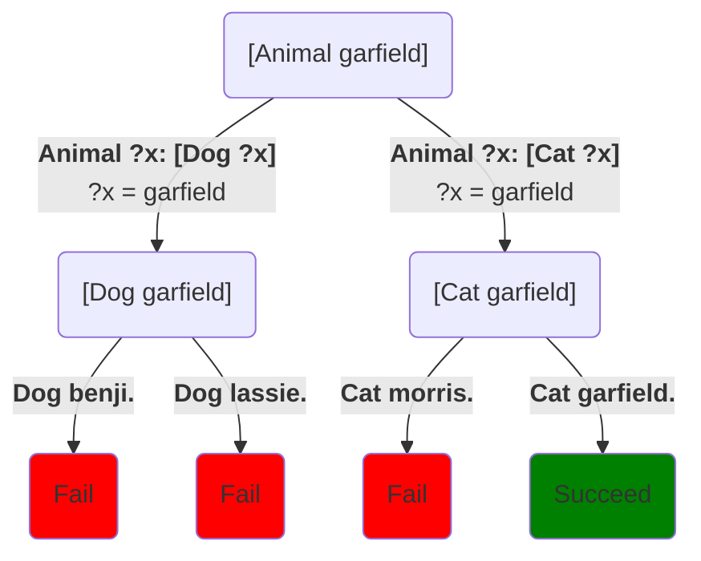
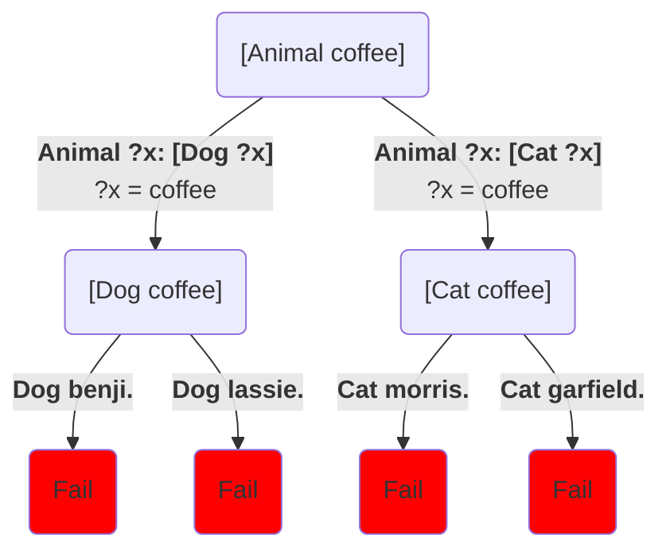
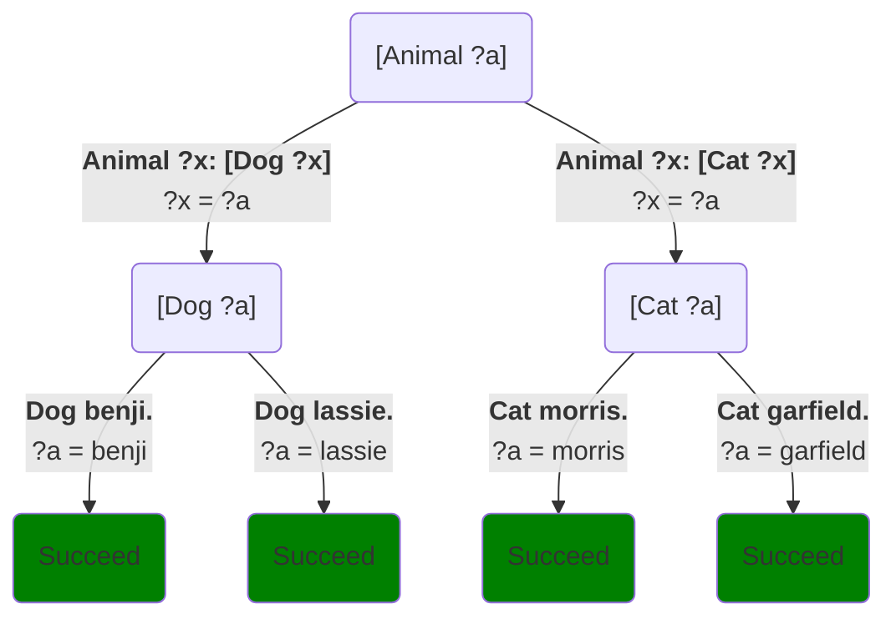

In the previous chapter, we discussed how a method such as:
```step
Weapon: [PreBuff] [WeaponType] [PostBuff]
```
can be though of as a **grammar rule** describing kinds of phrases:

> A (description of) a *weapon* is a *pre-buff* followed by a *weapon type* followed by a *post-buff*

This chapter explores how other kinds of methods can be thought of as **logical rules** describing possible inferences.  This introduces three big ideas:

* **Predicates**: tasks that answer questions rather than printing things
* **Soft failure**: calls in a method can fail.  This isn't an error, it just means Step tries another choice path.
* **Relaxed variables**: variables begin life without specific values and acquire values as your use them.

Together, they give us our first real example of clairvoyant (nondeterministic) programming: each call to each task involves choosing a method.  Some, or even most, of those methods might fail.  But the system behaves *as if* it always chooses correctly.

We'll see that this allows a programming style in which methods can be thought of as statements of fact. And the execution of certain tasks can naturally be thought of as answering questions about those facts.

## Preview

We'll go through these ideas more slowly in the rest of the chapter, but here's a quick example to give you a sense of where we're headed.  We're going to start by writing some methods for some Step tasks that don't print anything.  Don't worry about the `[predicate]` annotation[^1] or the fact that the methods end with periods rather than colons:
```Step
# Try: [Dog lassie]
[predicate]
Dog benji.
Dog lassie.

[predicate]
Cat morris.
Cat garfield.
```
If you aren't familiar with US pop culture from the 1970s, Benji and Lassie were famous dogs from movies, Morris was a cat from cat-food commercials, and Garfield is a famous cartoon cat.  So these methods form a little **database** of cats and dogs.

### Calls as queries

Remember that you can run code in boxes like the one above by clicking in side the box.  Try clicking above and running `[Dog lassie]`.

When we run `[Dog lassie]`, it works even though it doesn't print anything.  We say the call **succeeds**.  Its succeeds so long as there's a choice path through it that succeeds.  Here's the choice tree for it, and the path of the left succeeds, so the call succeeds:



It doesn't generate any output, but there is a path it can take the where the matching works.  It chooses that path, completes successfully, and the command line prints "yes", meaning the call worked.

Now what happens if we run `[Dog garfield]`? 
```Step
# Try: [Dog garfield]
[predicate]
Dog benji.
Dog lassie.

[predicate]
Cat morris.
Cat garfield.
```
Here's the choice tree:



Neither method matches, so both methods fail.  That means **the call itself fails**.  The command line prints "no".

So `Dog` executes successfully -- it **succeeds** -- if you call it with a parameter it knows to be a dog.  It **fails** if you call it with a something else.  So we can test the doghood of something by calling `Dog` with the something as a parameter.

Now what happens if we run `[Dog ?x]`?
```Step
# Try: [Dog ?]
[predicate]
Dog benji.
Dog lassie.

[predicate]
Cat morris.
Cat garfield.
```

Remember that Step lets you specify variables as parameters in the command line.  When you do that, it reports back the value it ended up with for that variable.  So what does running `[Dog ?x]` do?  Here's the choice diagram:



Either path is acceptable, but since `Dog` isn't tagged `[randomly]`, it prefers the first method over the second.  So the command line prints "yes" and tells you that `?x` = `benji`.

So this query is like asking "who is a dog?", or equivalently, "give me the name of a dog," and it replies `benji`.  If we tagged it `[randomly]` it would randomly choose one of the dogs each time we called it.

### Methods as inference rules

Now suppose we add another task that doesn't print anything:
```step
[predicate]
Animal ?x: [Dog ?x]
Animal ?x: [Cat ?x]
```

When we run `[Animal lassie]`, it succeeds.  Try it:
```Step
# Try: [Animal lassie]
[predicate]
Animal ?x: [Dog ?x]
Animal ?x: [Cat ?x]

[predicate]
Dog benji.
Dog lassie.

[predicate]
Cat morris.
Cat garfield.
```
It starts by choosing a method for `Animal`.  The chosen method then calls either `Dog` or `Cat`, so then it chooses a method for that.  Here's the choice tree:

Since there is a successful path, the command line prints "yes".


If we run `[Animal garfield]`, that succeeds too:
```Step
# Try: [Animal garfield]
[predicate]
Animal ?x: [Dog ?x]
Animal ?x: [Cat ?x]

[predicate]
Dog benji.
Dog lassie.

[predicate]
Cat morris.
Cat garfield.
```
It's basically the same choice tree, but with different variable values, and so a different solution path:


On the other hand, if we run `[Animal coffee]`, that call *fails*:
```Step
# Try: [Animal coffee]
[predicate]
Animal ?x: [Dog ?x]
Animal ?x: [Cat ?x]

[predicate]
Dog benji.
Dog lassie.

[predicate]
Cat morris.
Cat garfield.
```
Because every possible set of choices fails:


So, again `Animal` behaves like a test for animalhood: it succeeds when its argument is an animal.  It fails when the argument isn't an animal given the information available to the computer.  Once again, if we call `[Animal ?a]`, it will report back to us a value for `?a` that is an animal:


If we don't include `[randomly]` on any of the tasks, Step will always report the leftmost successful path (`?a` = `benji`).  But if we add `[randomly]` to all our tasks, then we have an random animal generator.  Try it a few times:
```Step
# Try: [Animal ?a]
[predicate] [randomly]
Animal ?x: [Dog ?x]
Animal ?x: [Cat ?x]

[predicate] [randomly]
Dog benji.
Dog lassie.

[predicate] [randomly]
Cat morris.
Cat garfield.
```

Although the computer is really just matching calls to methods, we as humans can interpret the method:
```step
Animal ?x: [Dog ?x]
```
as a rule saying:

> If $$x$$ is a dog, then it's an animal

Or equivalently:

> All dogs are animals

And similarly, the method:
```step
Animal ?x: [Cat ?x]
```
can be interpreted as:

> All cats are animals.

This is why researchers in the 1970s jumped on this idea of choice + pattern-matching as being a kind of logical reasoning and called it **logic programming**.

## Endnotes

[^1]: As well talk about [shortly](predicates), the `[predicate]` annotation simply tells Step not to consider failed calls to that task to be an error.