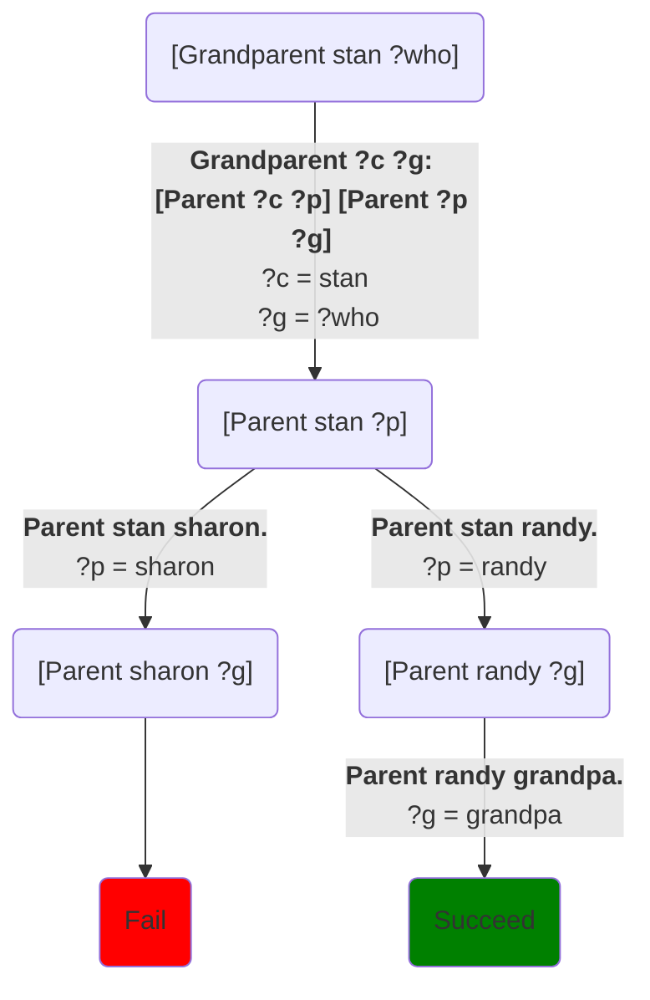

Now we can start to define other relationships:
```Step
# Try: [Grandparent stan ?who]
[predicate]
Grandparent ?c ?g: [Parent ?c ?p] [Parent ?p ?g]

[predicate]
Parent bart marge.
Parent bart homer.
Parent lisa homer.
Parent lisa marge.
Parent stan sharon.
Parent stan randy.
Parent randy grandpa.
Parent jimbo grandpa.
```
Which says that `?g` is a grandparent of grandchild `?c` if `?p` is a parent of `?c`, *and* `?g` is a parent of `?p`.  Note that we’ve adopted the convention that the grandparent is the second parameter.  But we could have chosen it to be the other way around; the computer doesn’t care.  The code for `Grandparent` looks almost the same as the code for `Sibling` -- it's just a change in how the parameters match up between the calls -- but it gives us a different choice tree and solutions:


The left branch fails because we haven't told the system anything about Sharon's parents.[^1]  But the right branch succeeds, because the database includes a parent for randy.