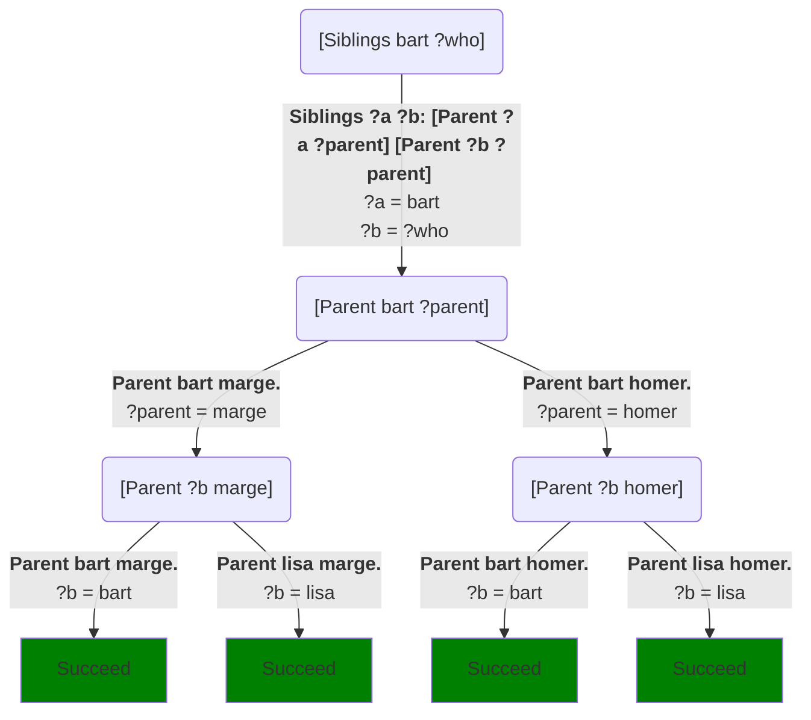
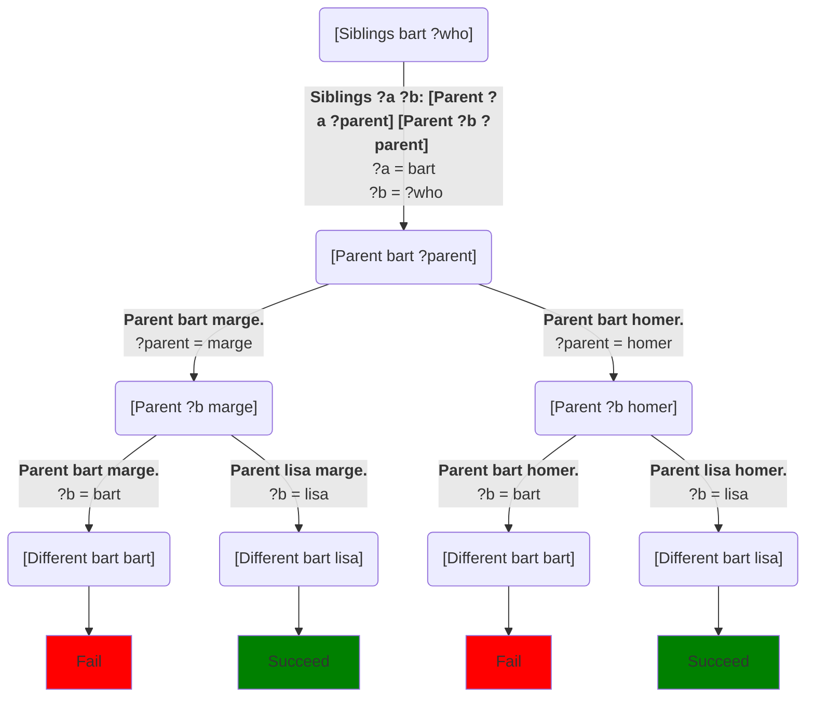
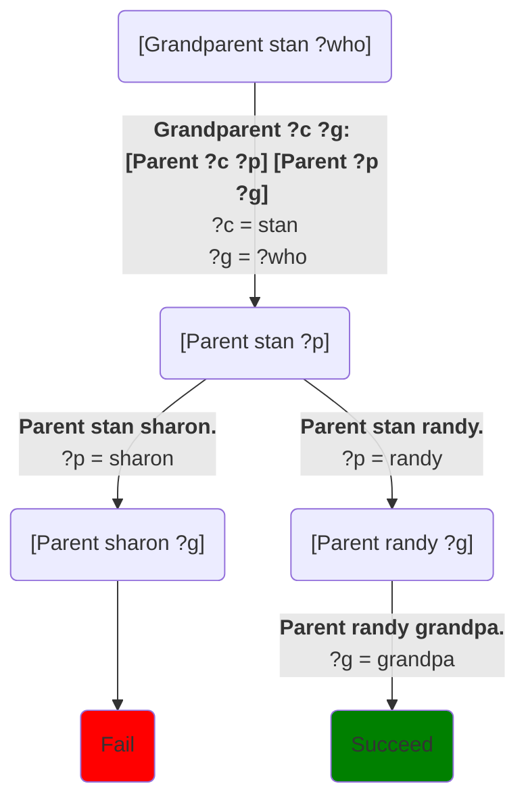
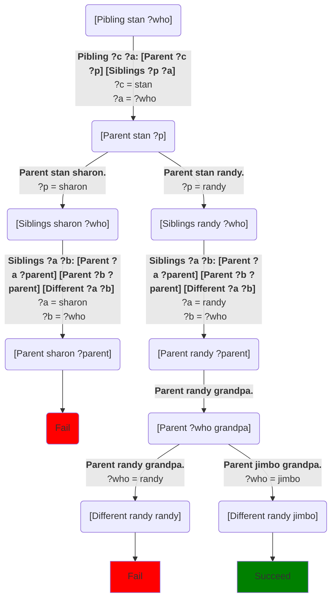

## Recap

At this point, we have enough tools to let the computer do something that we might call “reasoning.”  We have predicates, which are tasks that answer questions by succeeding or failing.  We think of calling a predicate as asking a question.  For example, we might call `[Loves rover fluffy]`.  If it succeeds, the answer is yes: Rover loves Fluffy.  If it fails, then answer is no; poor Fluffy.

We can also ask “who/what” questions by passing in a variable and letting the predicate fill it in.  If we run the command `[Loves rover ?x]`, we’re effectively is asking “who does Rover love?”  If it succeeds and fills in a value for `?x`, then we know Rover loves whoever was filled in for `?x`.  Rover might love other characters too, but we at least know one of them.


## Rules for reasoning

We’ve also seen how we can specify methods for predicates that are general rules about the truth of one predicate in terms of the truth of others.

For example, let's assume we've defined a predicate `Parent` so that `[Parent ?x ?y]` is true (succeeds) whenever `?x`’s parent is `?y`.  If we want to reason about sibling relationships, we don’t have to separately store who is a sibling of whom; we could derive that information from `Parent`:
```step
[predicate]
Siblings ?a ?b: [Parent ?a ?parent] [Parent ?b ?parent]
```
As far as the computer is concerned, that’s just a rule that says “if trying to run `Siblings`, first run `[Parent ?a ?parent]`, and if that succeeds, run `[Parent ?b ?parent]`”.  But another way of looking at it is that the method can only succeed if `?a` and `?b` have the same `?parent`.  So we could read it as a rule that effectively says that **people are siblings if they share a parent**.

This is a general technique we can use to write rules of the form “this is true if these things are also true.”  If we want to say A is true if B is true, we write:
```step
[predicate]
A: [B]
```
If we want to say A is true when B, C, and D are all true, then we say:
```step
[predicate]
A: [B] [C] [D]
```
If we want to say “A is true when either B is true or C and D are both true”, we can write two methods:
```step
[predicate]
A: [B]
A: [C] [D]
```
If we add parameters to the rules, everything needs to match up as it would for any of the other code we’ve seen.

## Reasoning about family relationships

Let’s return to our definition of siblinghood, and add a few family members to reason about:
```Step
# Try: [Siblings bart ?who]
[predicate]
Siblings ?a ?b: [Parent ?a ?parent] [Parent ?b ?parent]

[predicate]
Parent bart marge.
Parent bart homer.
Parent lisa homer.
Parent lisa marge.
Parent stan sharon.
Parent stan randy.
Parent randy grandpa.
Parent jimbo grandpa.
```
If we use the call `[Siblings bart ?who]` to ask who Bart's siblings are, we get the following choice tree.  Again, I'll only include the methods that match, so as to keep the diagram manageable:

There are a couple of things worth noticing here.  First, under this definition, **people are their own siblings**.  Moreover, since we didn't mark anything `[randomly]`, it always chooses the leftmost solution, which is that Bart is his own sibling.  If we don't want that, we can fix it by modifying the definition:
```Step
# Try: [Siblings bart ?who]
[predicate]
Siblings ?a ?b: [Parent ?a ?parent] [Parent ?b ?parent] [Different ?a ?b]

[predicate]
Parent bart marge.
Parent bart homer.
Parent lisa homer.
Parent lisa marge.
Parent stan sharon.
Parent stan randy.
Parent randy grandpa.
Parent jimbo grandpa.
```
`Different` is a [built-in predicate](primitive_tasks): it's not defined in terms of methods; rather, is a part of Step itself.  It succeeds if its two parameters are different, and fails if they're the same.  This gives us a slightly more elaborate choice tree, but one that filters out the result that Bart is his own sibling:


The other thing to notice here is that there are actually two different choice paths that give the same answer (Lisa).  That's fairly common in logic programming and generally not something to worry about.

### Grandparents

Now we can start to define other relationships:
```Step
# Try: [Grandparent stan ?who]
[predicate]
Grandparent ?c ?g: [Parent ?c ?p] [Parent ?p ?g]

[predicate]
Parent bart marge.
Parent bart homer.
Parent lisa homer.
Parent lisa marge.
Parent stan sharon.
Parent stan randy.
Parent randy grandpa.
Parent jimbo grandpa.
```
Which says that `?g` is a grandparent of grandchild `?c` if `?p` is a parent of `?c`, *and* `?g` is a parent of `?p`.  Note that we’ve adopted the convention that the grandparent is the second parameter.  But we could have chosen it to be the other way around; the computer doesn’t care.  The code for `Grandparent` looks almost the same as the code for `Sibling` -- it's just a change in how the parameters match up between the calls -- but it gives us a different choice tree and solutions:


The left branch fails because we haven't told the system anything about Sharon's parents.[^1]  But the right branch succeeds, because the database includes a parent for randy.

### Piblings

A [pibling](https://en.wikipedia.org/wiki/Family#Roles) is a parent's sibling, i.e. an aunt or uncle.  We can define piblings easily in terms of parents and siblings:
```Step
# Try: [Pibling stan ?who]
[predicate]
Pibling ?c ?a: [Parent ?c ?p] [Siblings ?p ?a]

[predicate]
Siblings ?a ?b: [Parent ?a ?parent] [Parent ?b ?parent] [Different ?a ?b]

[predicate]
Parent bart marge.
Parent bart homer.
Parent lisa homer.
Parent lisa marge.
Parent stan sharon.
Parent stan randy.
Parent randy grandpa.
Parent jimbo grandpa.
```
Which says that the pibling of a child is the sibling of the child's parent.  If we run `[Pibling stan ?who]` we get this choice tree:


Again, the left subtree fails because the *South Park* doesn't tell us anything about Sharon's siblings.[^1]

## Endnotes

[^1]: For those who aren't familiar, these examples are taken from the TV shows [*The Simpsons*](https://en.wikipedia.org/wiki/The_Simpsons) and [*South Park*](https://en.wikipedia.org/wiki/South_Park).  Sharon is a character from *South Park* and so far as I know, her parents haven't appeared in any episodes.  Or at least, Wikipedia doesn't list any names for them.