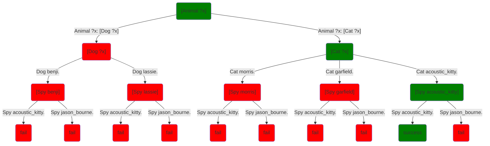

As you've probably guessed, your computer is not actually magic and does not actually violate the laws of time and causality.  The system  **searches** the tree of possible choices: it tries different paths until it finds one that works.  And once it finds a working one, it makes it look as if it never tried any other paths.

The bad news is that there can be a lot of choices, and so trying things until something works might not scale.  Even if a program only makes ten 2-way choices, there are $2^{10}=1024$ possible combinations of choices.  If the program makes 30 such choices, there are $2^{30}$ or approximately one billion combinations.  The good news is that programs can usually avoid trying most of the combinations.  The bad news is that sometimes they can't.  So if you're wondering why it is that the world didn't convert over to doing everything using logic programming 50 years ago, that's one reason, although the Japanese government did [give it a serious try](https://en.wikipedia.org/wiki/Fifth_Generation_Computer_Systems).

If you're not a programmer, that's probably all you need to know right now.  The rest of this page talks about how the system searches the tree.  Feel free to read on, but it's more technical.  We'll give you three different algorithmic answers to what's going on.  They're all correct; they're just different ways of saying the same thing, and some may be more useful than others in different contexts.

## Algorithmic answer 1: Depth-first search

If you've taken a data structures course or an AI course, you know there are several different ways of doing tree search.  Classical logic programming systems use the simplest technique: **depth-first search**.  That's all you need to know, so you can skip the next section if you like.

### *Esoteric*: why depth-first?

DFS often isn't the best strategy for searching a tree, but it's everybody's default strategy unless they have a good reason to do something else.  The something elses are:

* My tree has infinite paths
* I have a good way of guessing the best next choice
* I don't need any old solution, I need one that minimizes some function that's easy to estimate

If none of those hold, then DFS has better resource utilization than the alternatives.  Breadth-first search basically needs to hold the next level of the tree in its queue.  As you can see from the tree above, the number of nodes in a level can increase exponentially with depth.  So BFS can take space exponential in the depth of the tree.  But DFS only uses space that's linear in the depth.

The biggest disadvantage of DFS is that if you have an infinite tree, as you might have if your program has recursion, then DFS can get lost and recurse indefinitely, even if there's an easy solution up near the top of the tree.  This is one of the primary reasons that classical logic programming languages try methods in a fixed order: if you make sure your base cases come before your recursive cases, then you don't have to worry about DFS going into an infinite recursion.

You might say we should use breadth-first search instead.  But the performance penalty of BFS is severe enough that even when one has to worry about infinite paths, one often uses depth-first search with **iterative deepening** instead.  That means you run DFS, but have it give up any time it gets past a certain depth.  So you do, for example, a depth-first search of the first 5 levels of the tree.  If that doesn't work, you do a depth-first search of the first 10 levels of the tree, even though that redoes a lot of work you did before.  If that doesn't work, you do a DFS of the first 15 levels.  And so on.  That turns out to run faster on real hardware that BFS for most problems.

You may also have heard of informed-search strategies like best-first search, $A^*$, and so on.  Why don't we use these?  The main reason is that you need some way of measuring what's best.  So that means the programmer needs some way of specifying a heuristic function for the program that is going to vary meaningfully after every choice, so that it can always be used to guide the next choice.  That's proven difficult to do.  And in the absence of a good heuristic function, this informed search methods degenerate to breadth-first search, and so see above.

## Algorithmic answer 2: Predicates are iterators

Predicates are special not only in that they're allowed to fail, but they're allowed to **succeed more than once**.  The call `[Dog ?x]` has two different solutions: `benji` and `lassie`.  The call `[Cat ?x]` has `morris`, `garfield`, and `acoustic_kitty`.  The call `[Animal ?x]` has all five: `benji`, `lassie`,`morris`, `garfield`, and `acoustic_kitty`.

That said, predicates only find one solution at a time.  So when we call `[Dog ?x]`, we get `?x=benji` as we said.  But the predicate **remembers where it left off**, so that if it needs to find an alternate solution, it can continue executing.  When we run:
```step
[Animal ?who] [Spy ?who] 
```
It gets executed as:

* For each solution to `[Animal ?who]`
    * For each solution to `[Spy ?who]` that uses the variable value from the `Animal` call
        * Succeed

In this case, there's never going to be more than one solution to the `Spy` call that uses the variable value from the `Animal` call.  So functionally, the inner loop is just a check for whether `?who` is also a spy.  But this is in fact one of the ways that these kinds of languages get compiled.

So predicates basically because like [iterators](https://en.wikipedia.org/wiki/Iterator) or [generators](https://en.wikipedia.org/wiki/Generator_(computer_programming)) in languages like C# and Python: they each generate a stream of solutions with new variable bindings.

## Algorithmic answer 3: Backtracking

Each time the system gives up on a solution and asks the surrounding loop for a new answer, it has to undo any variable bindings from the previous answer, and then pick up from where it left off in surrounding loop.  This is referred to as **backtracking**.  The internal execution trace looks like this:

* Run `[Animal ?who]`
    * Animal tries its first method
        * That method runs `[Dog ?who]`
            * `Dog` succeeds with `?who=benji`
            * So `Animal` succeeds with `?who=benji`
                * Run `[Spy benji]`
                    * That fails
            * Restart `[Animal ?who]`, which restarts `Dog`
            * It picks up where it left off, giving us `?who=lassie`
               * Run `[Spy lassie]`, it fails again
            * Restart `[Animal ?who]`, which restarts `Dog`
                * `Dog` has run out of methods, so it fails
        * So `Animal`'s first method fails
    * Animal tries its second method
        * That method runs `[Cat ?who]`
            * `Cat` succeeds with `?who=morris`
            * So `Animal` succeeds with `?who=morris`
                * Run `[Spy morris]`
                    * That fails
            * Restart `Animal`, which restarts `Cat`, which yields `?who=garfield`, which also doesn't work
            * Restart `Animal`, which restarts `Cat`, which yields `?who=acoustic_kitty`
                * Run `[Spy acoustic_kitty]`
                    * Success!

This is still pretty hand-wavy, but we're not going to go into any more detail than this until [Part II](part_ii).  High performance implementations of backtracking can get almost comically complicated.  That's one of the reasons it's nice to use a language that does it for you so you don't have to implement it yourself.