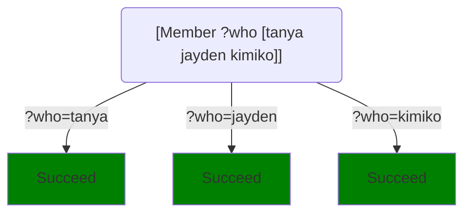
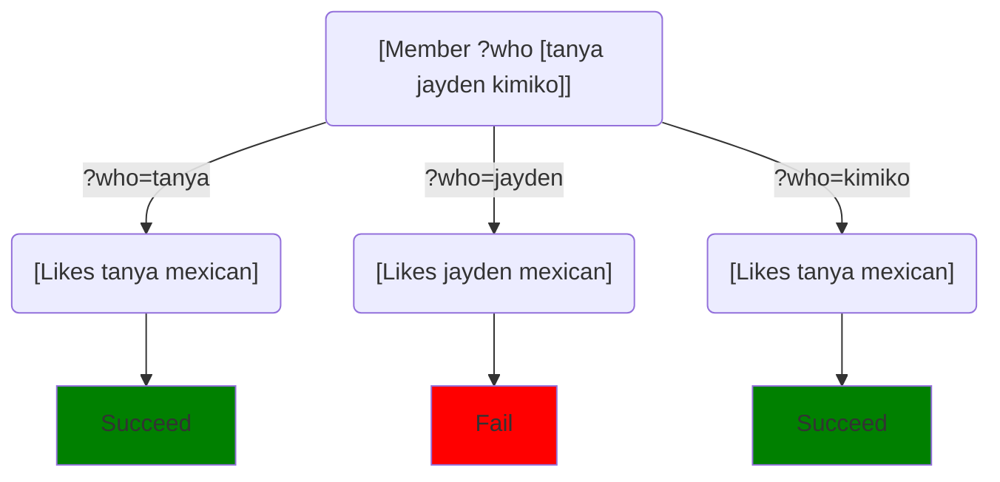

We've seen, some tasks calls to run as parameters.  These are known as [high-order tasks](wiki:Higher-order_function).  Higher-order tasks are used to do most of the complicated algorithmic work in logic programming, but they also have other uses.

There are a number of higher-order primitives, such as `Not`, but it's also common to write your own higher-order tasks.

## Higher-order primitives

Most higher-order primitive tasks either:
* Ask whether has a successful path **exists** for a given call, as with `Not`, or
* Ask something about **all** successful paths for the call.  These are the looping constructs of logic programs.  For example, `ForEach` and `Implies` ask whether something is true for all possible execution paths.  And `FindAll` and `AccumulateOutput`, which aggregate information about all successful paths of a call.

There are a few special-purpose higher-order primitives used for things like catching exceptions or controlling Step's search mechanisms, but those are relatively advanced features.

## Examples

Suppose we run:
```Step
[Member ?who [tanya jayden kimiko]]
```
This asks for a `?who` that is a member of the tuple `[tanya jayden kimiko]`.  It has one choice path for each element of the tuple, and all the choice paths are solutions:


If instead we run:
```Step
[Member ?who [tanya jayden kimiko]] [Like ?who mexican]
```
we're asking "is there someone in the list who likes mexican food?"  If our database says:
```step
[predicate]
Likes tanya sushi.
Likes tanya burgers.
Likes tanya mexican.
Likes jayden burgers.
Likes jayden ethiopean.
# Kimiko likes everything
Likes kimiko ?.
# Everyone likes pizza.
Likes ? pizza.
```
then the choice diagram for it is:

And, as we said, we're basically asking if there is **some** success path in the diagram.

### Checking all paths

Now suppose we run:
```Step
[Implies [Member ?who [tanya jayden kimiko]] [Like ?who mexican]]
```
This asks **does everyone in the list like Mexican food?**

## Code as tuples

As we've mentioned before, when you say:
```step
[Not [Number ?who]]
```
you are technically calling a predicate, `Not`, whose parameter is the **tuple** `[Number ?x]`.  The fact that tuples and calls are spelled the same way allows us to pass code as parameters to predicates and other tasks.

For the most part, you don't have to think about this.  It matters if you're writing your own higher-order primitives, or in a few cases where you write a higher-order task that modifies the code before running it.  Otherwise, you can safely ignore it.  We mention it primarily to reassure anyone who feels confused about whether these parameters are calls or tuples: they are both in some sense.
