Up to this point, I’ve used the deliberately vague language of “entities” and “attributes,” treating both the *kind* of thing an entity is (magic user, cat, tabby) and the adjectives (dark, light, short haired) that apply to it with the same nebulous term “attribute.”  However, the system is designed to interact in pseudo-English, and English makes distinctions between that concepts that are represented through nouns, verbs, and adjectives.  *Imaginarium* adopts this distinction, although its understanding of English is very limited.  Most of the concepts it understands fall into:

* **Proper nouns** (Fred, The Umbrella Corporation) name specific entities.
* **Common nouns** (cat, magic user, Siamese) name a kind of entity.
* **Adjectives** (big, small, dark, light) express yes/no properties of entities.
* **Verbs** (to love, to go to school at) express relationships between pairs of entities

There are other kinds of concepts it understands, but we’ll get to those later.

When you tell the system about a new concept, it remembers whether you used it as a noun, verb, or adjective, and will always use it as such in the future.  If you say `A glorp is a kind of monster`, it will know that `glorp` and `monster` are both nouns and that in future when telling you that an entity has the `glorp` attribute, it should tell you that by calling it, e.g. `a glorp`, rather than `a glorpish monster` or `an entity that’s glorp`.  It also knows that once it says the entity is a `glorp`, it doesn’t also need to tell you it’s a `monster`, because that’s implied by it being a `glorp`.

If you want to understand how *Imaginarium* is thinking about the words you use, you can use the **Show concepts** button.  Try using it on our magic user cat code:
```Imaginarium
# Try: imagine 10 magic user cats
A cat is a kind of person.
Persian, tabby, Siamese, manx, Chartreux, and Maine coon are kinds of cat.
Cats have an age between 1 and 20.
Cats are male or female.
A male cat has a name from male cat names
A female cat has a name from female cat names
Cats are long-haired or short-haired.
Cats can be big or small.
Cats can be cuddly or haughty.
A cat can be staid or crazy.
The plural of Chartreux is Chartreux.
The plural of Siamese is Siamese.
Chartreux are grey.
Siamese are grey.
Persians are long-haired.
Siamese are short-haired.
Maine coons are large.
Cats are black, white, grey, or ginger.

A magic user is dark or light
Thaumaturge, necromancer, neopagan, technopagan, and shaman are kinds of magic user.
Necromancers are dark
Thaumaturges are light
```
You should see something like:

```mermaid
---
config:
  layout: dagre
---
graph LR
   n0[cat] -- kind of --> n1[person]
   linkStyle 0 stroke-width:2px,fill:none,stroke:orange;
   n2[Persian] -- kind of --> n0
   linkStyle 1 stroke-width:2px,fill:none,stroke:orange;
   n3[tabby] -- kind of --> n0
   linkStyle 2 stroke-width:2px,fill:none,stroke:orange;
   n4[Siamese] -- kind of --> n0
   linkStyle 3 stroke-width:2px,fill:none,stroke:orange;
   n5[manx] -- kind of --> n0
   linkStyle 4 stroke-width:2px,fill:none,stroke:orange;
   n6[Chartreux] -- kind of --> n0
   linkStyle 5 stroke-width:2px,fill:none,stroke:orange;
   n7[Maine coon] -- kind of --> n0
   linkStyle 6 stroke-width:2px,fill:none,stroke:orange;
   n0 -- can be --> n8[male]
   linkStyle 7 stroke-width:2px,fill:none,stroke:green;
   n0 -- can be --> n9[female]
   linkStyle 8 stroke-width:2px,fill:none,stroke:green;
   n0 -- can be --> n10[long-haired]
   linkStyle 9 stroke-width:2px,fill:none,stroke:green;
   n0 -- can be --> n11[short-haired]
   linkStyle 10 stroke-width:2px,fill:none,stroke:green;
   n0 -- can be --> n12[big]
   linkStyle 11 stroke-width:2px,fill:none,stroke:green;
   n0 -- can be --> n13[small]
   linkStyle 12 stroke-width:2px,fill:none,stroke:green;
   n0 -- can be --> n14[cuddly]
   linkStyle 13 stroke-width:2px,fill:none,stroke:green;
   n0 -- can be --> n15[haughty]
   linkStyle 14 stroke-width:2px,fill:none,stroke:green;
   n0 -- can be --> n16[staid]
   linkStyle 15 stroke-width:2px,fill:none,stroke:green;
   n0 -- can be --> n17[crazy]
   linkStyle 16 stroke-width:2px,fill:none,stroke:green;
   n0 -- can be --> n18[black]
   linkStyle 17 stroke-width:2px,fill:none,stroke:green;
   n0 -- can be --> n19[white]
   linkStyle 18 stroke-width:2px,fill:none,stroke:green;
   n0 -- can be --> n20[grey]
   linkStyle 19 stroke-width:2px,fill:none,stroke:green;
   n0 -- can be --> n21[ginger]
   linkStyle 20 stroke-width:2px,fill:none,stroke:green;
   n0 -- has property --> n22[age]
   linkStyle 21 stroke-width:2px,fill:none,stroke:grey;
   n0 -- has property --> n23[name]
   linkStyle 22 stroke-width:2px,fill:none,stroke:grey;
   n2 -- is always --> n10
   linkStyle 23 stroke-width:2px,fill:none,stroke:green;
   n4 -- is always --> n20
   linkStyle 24 stroke-width:2px,fill:none,stroke:green;
   n4 -- is always --> n11
   linkStyle 25 stroke-width:2px,fill:none,stroke:green;
   n24[Thaumaturge] -- kind of --> n25[magic user]
   linkStyle 26 stroke-width:2px,fill:none,stroke:orange;
   n26[necromancer] -- kind of --> n25
   linkStyle 27 stroke-width:2px,fill:none,stroke:orange;
   n27[neopagan] -- kind of --> n25
   linkStyle 28 stroke-width:2px,fill:none,stroke:orange;
   n28[technopagan] -- kind of --> n25
   linkStyle 29 stroke-width:2px,fill:none,stroke:orange;
   n29[shaman] -- kind of --> n25
   linkStyle 30 stroke-width:2px,fill:none,stroke:orange;
   n25 -- can be --> n30[dark]
   linkStyle 31 stroke-width:2px,fill:none,stroke:green;
   n25 -- can be --> n31[light]
   linkStyle 32 stroke-width:2px,fill:none,stroke:green;
   n6 -- is always --> n20
   linkStyle 33 stroke-width:2px,fill:none,stroke:green;
   n7 -- is always --> n32[large]
   linkStyle 34 stroke-width:2px,fill:none,stroke:green;
   n24 -- is always --> n31
   linkStyle 35 stroke-width:2px,fill:none,stroke:green;
   n26 -- is always --> n30
   linkStyle 36 stroke-width:2px,fill:none,stroke:green;
style n0 fill:orange,color:#000,stroke:#000
click n0 callback "cat n. plural: cats"
style n1 fill:orange,color:#000,stroke:#000
click n1 callback "person n. plural: people"
style n2 fill:orange,color:#000,stroke:#000
click n2 callback "Persian n. plural: Persians"
style n3 fill:orange,color:#000,stroke:#000
click n3 callback "tabby n. plural: tabbies"
style n4 fill:orange,color:#000,stroke:#000
click n4 callback "Siamese n. plural: Siamese"
style n5 fill:orange,color:#000,stroke:#000
click n5 callback "manx n. plural: manxs"
style n6 fill:orange,color:#000,stroke:#000
click n6 callback "Chartreux n. plural: Chartreux"
style n7 fill:orange,color:#000,stroke:#000
click n7 callback "Maine coon n. plural: Maine coons"
style n8 fill:green,color:#000,stroke:#000
click n8 callback "male adj."
style n9 fill:green,color:#000,stroke:#000
click n9 callback "female adj."
style n10 fill:green,color:#000,stroke:#000
click n10 callback "long-haired adj."
style n11 fill:green,color:#000,stroke:#000
click n11 callback "short-haired adj."
style n12 fill:green,color:#000,stroke:#000
click n12 callback "big adj."
style n13 fill:green,color:#000,stroke:#000
click n13 callback "small adj."
style n14 fill:green,color:#000,stroke:#000
click n14 callback "cuddly adj."
style n15 fill:green,color:#000,stroke:#000
click n15 callback "haughty adj."
style n16 fill:green,color:#000,stroke:#000
click n16 callback "staid adj."
style n17 fill:green,color:#000,stroke:#000
click n17 callback "crazy adj."
style n18 fill:green,color:#000,stroke:#000
click n18 callback "black adj."
style n19 fill:green,color:#000,stroke:#000
click n19 callback "white adj."
style n20 fill:green,color:#000,stroke:#000
click n20 callback "grey adj."
style n21 fill:green,color:#000,stroke:#000
click n21 callback "ginger adj."
style n22 fill:grey,color:#000,stroke:#000
click n22 callback "age property between 1 and 20"
style n23 fill:grey,color:#000,stroke:#000
click n23 callback "name property chosen from male cat names or female cat names"
style n24 fill:orange,color:#000,stroke:#000
click n24 callback "Thaumaturge n. plural: Thaumaturges"
style n25 fill:orange,color:#000,stroke:#000
click n25 callback "magic user n. plural: magic users"
style n26 fill:orange,color:#000,stroke:#000
click n26 callback "necromancer n. plural: necromancers"
style n27 fill:orange,color:#000,stroke:#000
click n27 callback "neopagan n. plural: neopagans"
style n28 fill:orange,color:#000,stroke:#000
click n28 callback "technopagan n. plural: technopagans"
style n29 fill:orange,color:#000,stroke:#000
click n29 callback "shaman n. plural: shamen"
style n30 fill:green,color:#000,stroke:#000
click n30 callback "dark adj."
style n31 fill:green,color:#000,stroke:#000
click n31 callback "light adj."
style n32 fill:green,color:#000,stroke:#000
click n32 callback "large adj."
```

This shows you information about the different nouns and adjectives you've taught it, and how they relate to one another.  If you mouse over one of the concepts, it will give you more information about it, such as what the different forms (noun and plural) it thinks it has.