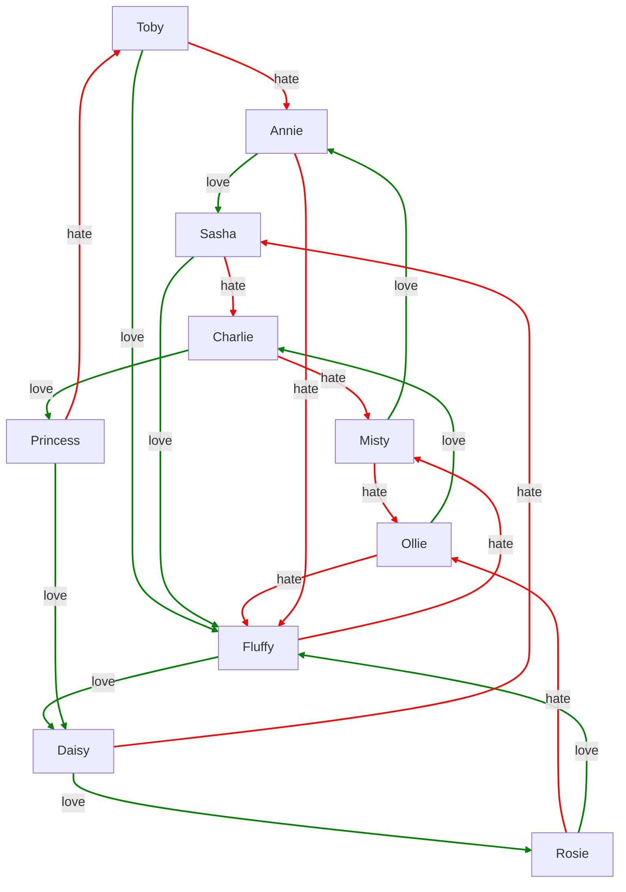

When *Imaginarium* generates objects with relationships, it also diagrams those relationships.  Suppose we allow our cats to love and hate each other.  To do this, we just  add the three lines at the end:
```Imaginarium
# Try: imagine 10 cats
A cat is a kind of person.
Persian, tabby, Siamese, manx, Chartreux, and Maine coon are kinds of cat.
Cats have an age between 1 and 20.
Cats are male or female.
A male cat has a name from male cat names
A female cat has a name from female cat names
Cats are long-haired or short-haired.
Cats can be big or small.
Cats can be cuddly or haughty.
A cat can be staid or crazy.
The plural of Chartreux is Chartreux.
The plural of Siamese is Siamese.
Chartreux are grey.
Siamese are grey.
Persians are long-haired.
Siamese are short-haired.
Maine coons are large.
Cats are black, white, grey, or ginger.

Cats can love one other cat.
Cats can hate one other cat.
Love and hate are mutually exclusive.
```
Click this, and then press the Run button as usual.  This will make 10 cats.  But if you scroll down, you will see it also diagrams their relationships.  For example,

This lets you see all the generated cats and who loves or hates whom.  If you mouse over one of the cats, it will also show you the information about that particular cat.