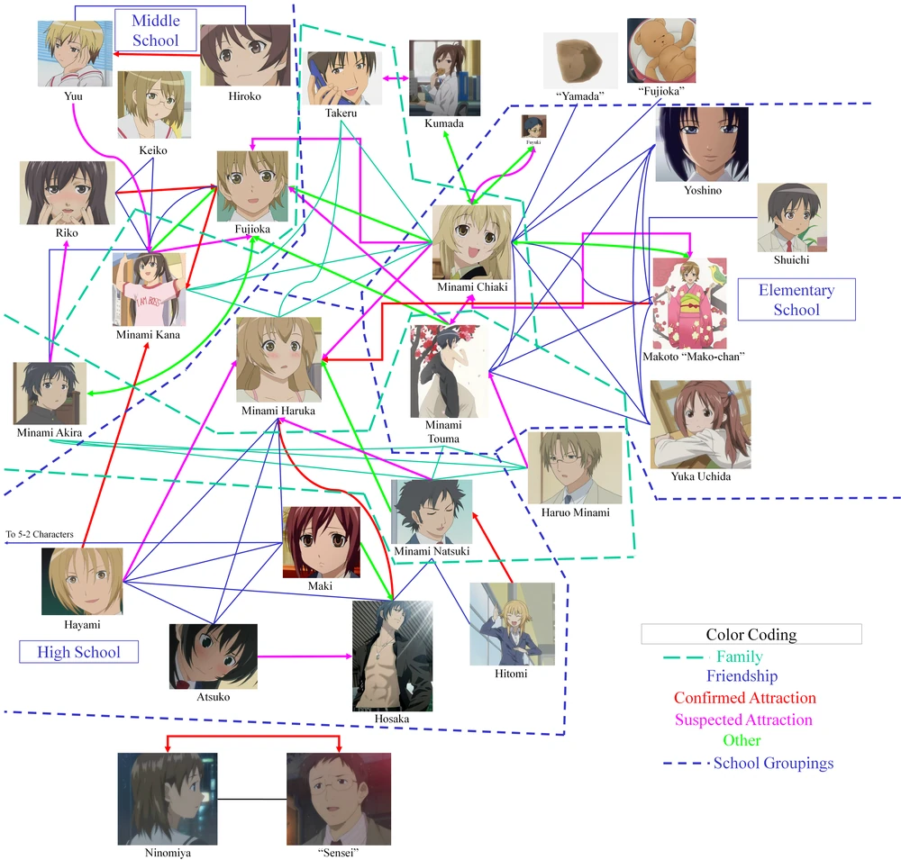

## Overview
In this assignment, you will make a collection of characters connected by different sorts of relationships.  You could think of it as generating setups for *Fiasco* or making one of the relationship charts you sometimes see for manga and anime.  For example, this is a character relationship chart for the manga/anime [*Minami-ke*](wiki:Minami-ke):[^1]
 


Whether you think of yourself as generating setups for a narrative game like *Fiasco* or fandom artifacts for anime series from an alternate universe, you’re still fundamentally making a diagram of narratively interesting relationships between characters in a story.  So make some characters, character subkinds, and so on, and a bunch of relationships that seem like they might be interesting.  Then type
```imaginarium
imagine 10 characters
```
(or 5 or 50, whatever you want) and see what happens.

That’s basically the requirement.  Don’t worry about passing unit tests.  Just have fun.  You’ve earned it.

Feel free to start from this base, or to do something completely different:
```Imaginarium
# Try: imagine 10 characters
Humans have an age between 1 and 70.
A human is male, female or nonbinary.
A human is masculine-named or feminine-named.
A male human is masculine-named.
A female human is feminine-named
A human has a surname from English surnames.
A masculine-named human has a given name from male names.
A feminine-named human has a given name from female names.
A human is identified as "[given name] [surname]".
Do not mention being masculine-named.
Do not mention being feminine-named.
```
This version handles non-binary gender, but it does end up generating a disproportionately large number of non-binary characters.  If you prefer to use binary gender, use this:
```Imaginarium
# Try: imagine 10 characters
Characters have an age between 1 and 70.
A character is male or female.
A character has a surname from English surnames.
A male character has a given name from male names.
A female character has a given name from female names.
A character is identified as "[given name] [surname]".
```

## Relationship hacking

As you’ll remember from the [the tutorial](Imaginarium), relationships are represented using verbs.  When you define a verb, Imaginarium basically needs to know the following:
- What’s it called?
- What kinds of things go on the left side (subjects of the verb)?
- What kinds of things go on the right side (objects of the verb)?
- Does it have any special properties?
    - Symmetric: if I’m friends with you, you’re friends with me.
    - Anti-symmetric: if I work for you, you don’t work for me.
    - Reflexive: we’re all friends with ourselves
    - Anti-reflexive: we don’t work for ourselves
    - Numerical limits: an employee works for one employer, a child is parented by at least one adult
    - Is it a special kind of some other relationship?

For example, let’s say we’re making a Fiasco setup.  We could start by saying:
```imaginarium
Characters can relate each other
```
Which says that `relate` is a verb and both its subject and object are characters.  Apologies for saying `relate` rather than `relate to`, which would read better.  But I haven’t had time to modify the code that conjugates verbs to understand how to make certain conjugations when there’s a preposition at the end.  So `relate` it is.

The `each other` part tells the system it’s symmetric: if I relate you, you relate me.  But this still leaves open the possibility that the system will generate characters, one of whose relationships is with themselves.  We want to outlaw that by saying that relating is anti-reflexive.  We can do that by saying:
```imaginarium
Characters cannot relate themselves.
```
And finally, we can say everybody should have two relationships.  You do that by saying:
```imaginarium
A character must relate two other characters.
```
You can do variations on this.  You can change the number:
```imaginarium
A character must relate three other characters.
```
You just put a lower bound on the number of relationships rather than requiring a specific number:
```imaginarium
A character must relate at least two other characters.
```
Or you can make it an upper bound.  Notice that in this form, you say `can` rather than `must` because if there’s only an upper bound, then zero is an allowable number:
```imaginarium
A character can relate up to two other characters.
```
Finally, you can specify kinds of relationships:
```imaginarium
Loving is a way of relating.
Hating is a way of relating.
```
Each of these introduces a new verb (`love` and `hate`, respectively), which from context must also take `character`s as their subjects and objects, since that’s what `relate` does.  Moreover, if a character `loves` or `hates` another character, then it also automatically `relate`s it.  But more than that, the `is a way of` construction says that if two characters are to `relate`, then must either `love` or `hate` one another, or one of the other ways of `relat`ing, assuming you’ve specified more.

So `is a way of` is the direct equivalent for verbs of `is a kind of` for nouns.  There can be many different ways of `relat`ing, and since we told every character has to `relate` two other characters, the system has to, for each character, pick two characters for them to `relate` and then pick a specific verb that is a way of relating for that pair of characters.

## Making relationship charts

That’s really all you have to do to make relationship charts:
- Introduce a noun for characters – you can use the one of the examples from class or this book if you like.
- Introduce the basic boilerplate for `relate` (or you can call it something else like connect if you prefer):
   - `Characters can relate each other.`
   - `Characters cannot relate themselves.`
- If you just say this, even on average every character will be connected to half the other characters, and that gets overwhelming.  So put some kind of limit on it, like:
    - `Characters must relate two other characters`
    - `Characters can relate to up to four other characters`
- Introduce a bunch of interesting verbs and make them all be `ways of relating` (or `connecting`, or whatever verb you choose)
- Type `imagine 10 characters` (or 5 or whatever)

## Specializing verbs to kinds of characters

Just because a verb is a way of relating doesn’t mean it has to apply to all characters.  For example, if we say:
```imaginarium
Adult and child are kinds of character.
Children can be big or small.
```
Then we can make verbs that are specialized to kinds of characters:
```imaginarium
An adult can parent many children.
Parenting is a way of relating.
Children can be friends with each other.
Being friends with is a way of relating.
A big child can bully a small child.
Bullying is a way of relating.
An adult can be secretly in love with another adult.
Being secretly in love with is a way of relating.
```
So even though relate is a general verb that can apply to any pair of characters, big or small, adult or child, there can be ways of relating that are specific to adults, to children, to one of each, or even to specific kinds of children.

## What to do

The only requirements are that you include at least:
- 10 verbs (more if you like)
- 5 character types
    - Don’t feel obligated to use humans as your base for characters.  Cats, monsters, monster cats, bears, dogs, and semi-sapient kitchen appliances are all valid.
- 10 adjectives to describe the characters
- You specialize some of the verbs to particular character types.

Important: while you may reuse code from our examples, you may not count that code toward the requirements of the assignment.  That is, you can copy in the cat stuff or the Fiasco stuff if you like, but you still have to add 10 more verbs, 5 more character types, and 10 more adjectives on top of whatever you copied over.  If you do use other code, be sure to acknowledge it in your code.  That is, add a comment before the copied code saying something like this (the # at the beginning marks it as a comment):
```imaginarium
# The following 10 lines were copied from cats.
```
Otherwise just have fun.  Make something that surprises you, or makes you imagine stories, or that just makes you laugh.

## Flash fiction
Now generate some relationship maps until you find something you find interesting.  Write a bit of flash fiction about some or all of the characters you generate.  In particular, write a story of at least 6 sentences and no more than one page.  As always, we will not be grading you on the quality of your fiction.  We just want you to try it and have fun.  Put your fiction in a txt or pdf file in the directory with your generator.


## Endnotes

[^1]: Source: [https://minami-ke.fandom.com/wiki/Character_Pairings_(Minami-ke)](https://minami-ke.fandom.com/wiki/Character_Pairings_(Minami-ke)), under creative commons non-commercial license.  Note that I haven't read *Miname-ke*, so this isn't an endorsement.