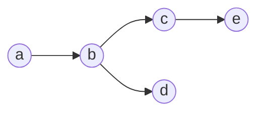

Tuples are the math equivalent of lists/arrays: they're sequences of elements rather than sets of them.  A tuple with $$n$$ elements is called an $$n$$-tuple.  For tuples with only 2 elements, we usually say "pair" rather than $$2$$-tuple.  Similarly, $$3$$-tuples are often called "triples".

Tuples are notated using parentheses rather than curly brackets, a notation that's also used in programming languages such as Python and C#:
* $$(a,b)$$ is the pair whose first element is $$a$$ and whose second is $$b$$. 
* $$(a,b,c)$$ is the same, but is a 3-tuple and it has the third element $$c$$.

## Sets vs. tuples

First, and most importantly, sets and tuples are different things.  $$(a,b)$$ and $$\{ a, bc \}$$ are different objects and are not interchangeable.  

Technically, most set theories define tuples as an esoteric kind of set.[^1]  But we will treat them as unrelated types of objects.

Unlike sets, the position of an element within a tuple matters; sets don't have a notion of position..  The same element can also appear in multiple positions in a tuple, but cannot in a set.  The differences are summarized here:

| Elements | As sets                  | As tuples                  |
| -------- | -------                  | ---------                  |
| $$a,b$$  | $$\{a,b\} = \{b,a\}$$    | $$(a,b)\neq(b,a)$$         |
| $$a,a$$  | $$\{a,a\}$$ is not a set | $$(a,a)$$ is a valid tuple |

## Uses of tuples in mathematics

In programming, we have two kinds of objects that are sequences of other objects.  Arrays are sequences in which the elements are numbered (first, second, etc.), and records (such as classes in C#) are sequences in which the elements are named.

For better or worse, mathematics just has tuples.  So they get used both for things that are like arrays, such as vectors, but also for everything else.  We'll talk about [graphs](Graphs) later, but if you don't know what they are, they're networks of nodes, called vertices, connected by lines or arrows, called edges.  For example, in the graph:

the vertices are $$\{ a,b,c,d,e\}$$ and the edges are the various arrows.  When programming, we would likely define these as a class:
```c#
public class Graph {
    public Vertex[] Vertices;
    public Edge[] Edges;
}
```
where we can refer to the vertices as and edges of a given graph `g` with `g.Vertices` and `g.Edges`, respectively.

Math textbooks generally define graphs as pairs: $$(\text{Vertices}, \text{Edges})$$. However, the mathematical tradition is to use single letters rather than complex names, so the standard definition of a graph is that it is a pair $$(V,E)$$ where $$V$$ is a set of veritices and $$E$$ is a set of edges.

## Endnotes

[^1]: *Esoterica*: A pair $$(a,b)$$ is usually defined to be the set $$\{a,\{a,b\}\}$$.  This lets us know that it has both $$a$$ and $$b$$ but that the $$a$$ comes first because the pair $$(b,a)$$ is the set $$\{b, \{a,b\}\}$$.  Longer tuples are then pairs of pairs: $$(a,b,c)=(a,(b,c))=\{a, \{a, \{b, \{b, c\}\}\}\}$$, as they might be defined in languages like Lisp and Scheme that build everything linked lists of pairs.  Note that this technically means that you can't decide without context whether $$\{a, \{a, b\}\}$$ is meant to be a "real" set or a pair.  There's no type checking.  It also means that 1-tuples aren't really a thing; when you want to say $$(a)$$ you just say $$a$$.  And 0-tuples ("empty tuples") aren't a think either.  In practice, everyone ignores these issues because it's generally clear from context what someone means.